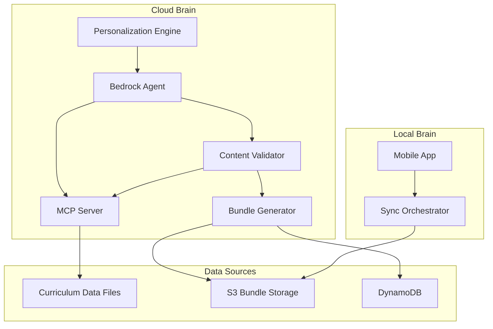
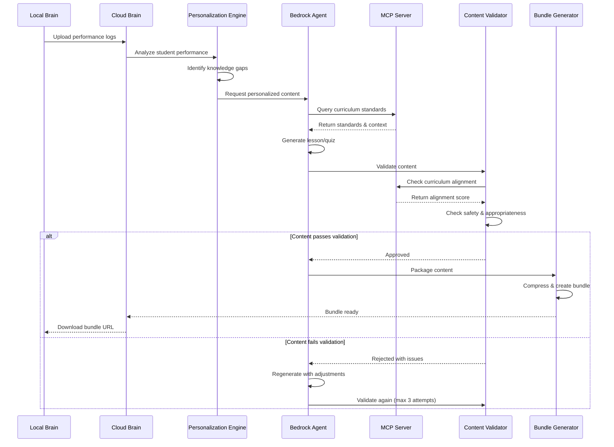

# Design Document: Curriculum MCP Server Integration and Content Generation

## Overview

This design document specifies the integration of an MCP (Model Context Protocol) Server with the Sikshya-Sathi Cloud Brain to enable curriculum-aligned content generation using Amazon Bedrock Agent. The system ensures that all generated lessons and quizzes adhere to Nepal K-12 curriculum standards for grades 6-8 in Mathematics, Science, and Social Studies.

### Design Principles

1. **Curriculum Fidelity**: All content must align with Nepal K-12 standards (minimum 70% alignment score)
2. **Offline-First Compatibility**: Generated content packaged for offline consumption on Local Brain
3. **Quality Assurance**: Multi-layer validation pipeline ensures content appropriateness and accuracy
4. **Performance**: Content generation completes within defined time limits to support sync operations
5. **Personalization**: Content adapts to individual student knowledge models and learning velocity
6. **Graceful Degradation**: System continues operating with cached curriculum data if MCP Server unavailable

### Key Components

- **MCP Server**: Provides authoritative Nepal K-12 curriculum data and validation tools
- **Bedrock Agent**: Generates personalized lessons, quizzes, and hints using Claude 3.5 Sonnet
- **Content Validator**: Validates generated content for curriculum alignment, safety, and appropriateness
- **Bundle Generator**: Packages validated content into compressed learning bundles
- **Personalization Engine**: Analyzes student performance to guide content selection

## Architecture

### System Context



### Content Generation Flow



### Data Flow

1. **Sync Initiation**: Local Brain uploads performance logs to Cloud Brain
2. **Performance Analysis**: Personalization Engine analyzes logs and updates knowledge model
3. **Content Planning**: Engine identifies topics needing coverage based on gaps and progression
4. **Curriculum Query**: Bedrock Agent queries MCP Server for relevant curriculum standards
5. **Content Generation**: Agent generates lessons/quizzes with curriculum context
6. **Validation**: Content Validator checks alignment, safety, and appropriateness
7. **Regeneration Loop**: Failed content regenerated up to 3 times with adjusted prompts
8. **Bundle Creation**: Approved content compressed into learning bundle
9. **Storage**: Bundle stored in S3 with metadata in DynamoDB
10. **Download**: Local Brain downloads bundle via presigned URL

## Components and Interfaces

### 1. MCP Server

#### 1.1 Purpose

Provides authoritative Nepal K-12 curriculum data to Bedrock Agent and validates generated content alignment with national education standards.

#### 1.2 Data Loading

**Curriculum Data Source**: JSON files in `cloud-brain/src/mcp/data/curriculum_standards.json`

**Data Schema**:
```json
{
  "id": "MATH-6-001",
  "grade": 6,
  "subject": "Mathematics",
  "topic": "Whole Numbers and Operations",
  "learning_objectives": [
    "Perform addition and subtraction with whole numbers up to 1,000,000",
    "Solve word problems involving multiple operations"
  ],
  "prerequisites": [],
  "bloom_level": "apply",
  "estimated_hours": 8.0,
  "keywords": ["addition", "subtraction", "whole numbers", "operations"]
}
```

**Loading Process**:
1. On MCP Server initialization, load curriculum_standards.json
2. Validate schema for each standard (grade range, required fields)
3. Index standards by ID, grade, and subject for efficient retrieval
4. Log loading statistics (count, any validation errors)
5. If file missing or corrupted, log error and initialize with empty data

**Performance Requirement**: Complete loading within 5 seconds

#### 1.3 Exposed Tools

The MCP Server exposes four tools for Bedrock Agent integration:

**Tool 1: get_curriculum_standards**

```python
def get_curriculum_standards(grade: int, subject: str) -> list[CurriculumStandard]:
    """
    Get all curriculum standards for a specific grade and subject.
    
    Args:
        grade: Grade level (6-8)
        subject: Subject name (Mathematics, Science, Social Studies)
        
    Returns:
        List of curriculum standards with learning objectives, prerequisites,
        Bloom level, and estimated hours
    """
```

**Tool 2: get_topic_details**

```python
def get_topic_details(topic_id: str) -> Optional[TopicDetails]:
    """
    Get comprehensive information about a specific curriculum topic.
    
    Args:
        topic_id: Unique topic identifier (e.g., "MATH-6-001")
        
    Returns:
        TopicDetails including assessment criteria, subtopics, and resources
    """
```

**Tool 3: validate_content_alignment**

```python
def validate_content_alignment(
    content: str, 
    target_standards: list[str]
) -> ContentAlignment:
    """
    Validate generated content alignment with curriculum standards.
    
    Args:
        content: Generated lesson or quiz content
        target_standards: List of target standard IDs
        
    Returns:
        ContentAlignment with score, matched standards, gaps, and recommendations
    """
```

**Tool 4: get_learning_progression**

```python
def get_learning_progression(
    subject: str, 
    grade_start: int, 
    grade_end: int
) -> Optional[LearningProgression]:
    """
    Get learning progression showing topic sequence and dependencies.
    
    Args:
        subject: Subject name
        grade_start: Starting grade
        grade_end: Ending grade
        
    Returns:
        LearningProgression with topic sequence, dependencies, and difficulty progression
    """
```

#### 1.4 Alignment Validation Algorithm

**Keyword Matching Approach**:
1. Extract keywords from target curriculum standards
2. Convert content and keywords to lowercase for case-insensitive matching
3. Count keyword matches in content
4. Calculate alignment score: `matched_standards / total_target_standards`
5. Threshold: 0.7 (70%) for approval
6. Identify gaps: standards with no keyword matches
7. Generate recommendations for improving alignment

**Example**:
```python
# Target: MATH-6-001 with keywords ["addition", "subtraction", "whole numbers"]
# Content: "This lesson teaches addition and subtraction of whole numbers..."
# Matches: 3/3 keywords found
# Alignment score: 1.0 (100%)
# Result: ALIGNED
```

### 2. Bedrock Agent Content Generation

#### 2.1 Agent Configuration

**Foundation Model**: `anthropic.claude-3-5-sonnet-20241022-v2:0`

**Agent Instructions**:
```
You are an expert educational content generator for Sikshya-Sathi, creating personalized 
learning materials for rural Nepali K-12 students (grades 6-8).

Your responsibilities:
1. Generate lessons aligned with Nepal K-12 curriculum standards
2. Create quizzes assessing understanding at appropriate Bloom's taxonomy levels
3. Provide progressive hints guiding students without revealing answers
4. Use culturally appropriate examples relevant to Nepal
5. Ensure age-appropriate language and complexity
6. Support both Nepali and English languages
7. Incorporate metric system and Nepali currency (NPR) in examples

Before generating content:
- Query MCP Server for curriculum standards using get_curriculum_standards
- Review learning objectives and prerequisites
- Ensure content addresses specified standards

Content structure requirements:
- Lessons: Include explanation, example, and practice sections
- Quizzes: Mix question types (multiple-choice, true/false, short-answer)
- All content: Reference curriculum standard IDs
```

#### 2.2 Lesson Generation

**Input Parameters**:
```typescript
interface LessonGenerationRequest {
  topic: string;              // e.g., "Whole Numbers and Operations"
  subject: string;            // "Mathematics", "Science", "Social Studies"
  grade: number;              // 6, 7, or 8
  difficulty: string;         // "easy", "medium", "hard"
  curriculum_standards: string[];  // ["MATH-6-001"]
  student_context: {
    proficiency: number;      // 0-1 scale
    learning_velocity: number; // topics per week
    recent_performance: number; // recent quiz accuracy
  };
}
```

**Generation Process**:
1. Query MCP Server for curriculum standards
2. Retrieve topic details including learning objectives
3. Generate lesson with three section types:
   - **Explanation**: Concept introduction with clear definitions
   - **Example**: Worked examples demonstrating the concept
   - **Practice**: Exercises for student application
4. Include cultural context (Nepal-specific examples)
5. Support bilingual content (English and Nepali)
6. Assign unique lesson ID
7. Reference curriculum standard IDs

**Output Structure**:
```typescript
interface Lesson {
  lesson_id: string;
  subject: string;
  topic: string;
  title: string;
  difficulty: "easy" | "medium" | "hard";
  estimated_minutes: number;
  curriculum_standards: string[];
  sections: LessonSection[];
}

interface LessonSection {
  type: "explanation" | "example" | "practice";
  content: string;  // Markdown format
  media?: Array<{
    type: "image" | "audio";
    url: string;
    alt?: string;
  }>;
}
```

**Performance Requirement**: Generate single lesson within 30 seconds

#### 2.3 Quiz Generation

**Input Parameters**:
```typescript
interface QuizGenerationRequest {
  topic: string;
  subject: string;
  grade: number;
  difficulty: string;
  question_count: number;     // 3-10 questions
  learning_objectives: string[];
}
```

**Generation Process**:
1. Query MCP Server for curriculum standards
2. Generate questions covering learning objectives
3. Mix question types:
   - Multiple-choice (2-5 options)
   - True/false
   - Short-answer
4. Include correct answer and explanation for each question
5. Tag questions with Bloom's taxonomy level
6. Reference curriculum standard IDs
7. Assign unique quiz and question IDs

**Output Structure**:
```typescript
interface Quiz {
  quiz_id: string;
  subject: string;
  topic: string;
  title: string;
  difficulty: "easy" | "medium" | "hard";
  time_limit?: number;  // minutes
  questions: Question[];
}

interface Question {
  question_id: string;
  type: "multiple_choice" | "true_false" | "short_answer";
  question: string;
  options?: string[];  // for multiple choice
  correct_answer: string;
  explanation: string;
  curriculum_standard: string;
  bloom_level: "remember" | "understand" | "apply" | "analyze" | "evaluate" | "create";
}
```

**Performance Requirement**: Generate single quiz within 20 seconds

### 3. Content Validation Pipeline

#### 3.1 Validation Orchestrator

The Content Validator combines curriculum validation and safety filtering:

**Validation Steps**:
1. **Curriculum Alignment Check**: Validate against MCP Server (70% threshold)
2. **Age-Appropriateness Check**: Verify language complexity matches grade level
3. **Language Appropriateness Check**: Ensure Nepali cultural context
4. **Safety Filter**: Detect inappropriate content using Bedrock Guardrails
5. **Cultural Appropriateness Check**: Verify Nepal-specific context

**Validation Result**:
```typescript
interface ValidationResult {
  content_id: string;
  content_type: "lesson" | "quiz";
  status: "passed" | "failed" | "needs_regeneration";
  passed_checks: string[];
  failed_checks: string[];
  issues: string[];
  alignment_score: number;
}
```

#### 3.2 Regeneration Logic

**Regeneration Trigger**: Content fails any validation check

**Process**:
1. Identify specific issues from validation result
2. Adjust Bedrock Agent prompt with issue details
3. Regenerate content with adjusted parameters
4. Validate regenerated content
5. Repeat up to 3 times
6. If still failing after 3 attempts, mark as failed and log error

**Exponential Backoff**: 1s, 2s, 4s delays between attempts

#### 3.3 Performance Requirements

- Single content validation: Complete within 5 seconds
- Complete bundle generation (10-15 items): Complete within 5 minutes
- Validation includes MCP Server calls, safety checks, and logging

### 4. Learning Bundle Generation

#### 4.1 Bundle Composition

**Bundle Structure**:
```typescript
interface LearningBundle {
  bundle_id: string;
  student_id: string;
  valid_from: Date;
  valid_until: Date;  // 14 days from generation
  subjects: SubjectContent[];
  total_size: number;  // bytes
  checksum: string;    // SHA-256
  presigned_url?: string;
}

interface SubjectContent {
  subject: string;
  lessons: Lesson[];
  quizzes: Quiz[];
  hints: Record<string, Hint[]>;  // question_id -> hints
  revision_plan?: RevisionPlan;
  study_track?: StudyTrack;
}
```

#### 4.2 Content Selection Strategy

**Personalization Rules**:
1. Analyze student performance logs from last sync
2. Identify knowledge gaps (topics with <70% quiz accuracy)
3. Prioritize content for gap topics
4. Select difficulty based on recent performance:
   - <60% accuracy: Select "easy" difficulty
   - 60-80% accuracy: Select "medium" difficulty
   - >80% accuracy: Select "hard" difficulty or advance to next topic
5. Follow curriculum prerequisites and learning progression
6. Generate 2-4 weeks of content based on student pace

**Content Mix**:
- 60% new material (topics not yet covered)
- 30% practice (topics in progress)
- 10% review (previously mastered topics)

#### 4.3 Compression and Storage

**Compression**:
- Use gzip compression for JSON content
- Target: <5MB per week of content
- Compress lessons, quizzes, and hints separately
- Calculate SHA-256 checksum for integrity verification

**Storage**:
- Store compressed bundle in S3: `s3://sikshya-sathi-bundles/{student_id}/{bundle_id}.gz`
- Generate presigned URL valid for 14 days
- Store metadata in DynamoDB:
  ```json
  {
    "bundle_id": "bundle-123",
    "student_id": "student-456",
    "generation_timestamp": "2024-01-15T10:30:00Z",
    "size_bytes": 4500000,
    "content_count": 12,
    "subjects": ["Mathematics", "Science"],
    "valid_until": "2024-01-29T10:30:00Z",
    "s3_key": "student-456/bundle-123.gz",
    "checksum": "sha256:abc123..."
  }
  ```

### 5. Content Synchronization

#### 5.1 Sync API Endpoints

**Upload Performance Logs**:
```
POST /api/sync/upload
Request: {
  studentId: string;
  logs: PerformanceLog[];  // compressed
  lastSyncTime: Date;
}
Response: {
  sessionId: string;
  logsReceived: number;
  bundleReady: boolean;
}
```

**Download Learning Bundle**:
```
GET /api/sync/download/:sessionId
Response: {
  bundleUrl: string;  // S3 presigned URL
  bundleSize: number;
  checksum: string;
  validUntil: Date;
}
```

#### 5.2 Local Brain Integration

**Bundle Download Process**:
1. Receive presigned URL from Cloud Brain
2. Download bundle with resume support (HTTP Range requests)
3. Verify checksum before extraction
4. If checksum fails, reject bundle and log error
5. Extract lessons and quizzes from compressed bundle
6. Insert content into SQLite database
7. Preserve curriculum standard IDs, difficulty levels, estimated times
8. Mark sync session as successful

**Database Schema** (Local Brain SQLite):
```sql
CREATE TABLE lessons (
  lesson_id TEXT PRIMARY KEY,
  student_id TEXT NOT NULL,
  subject TEXT NOT NULL,
  topic TEXT NOT NULL,
  title TEXT NOT NULL,
  difficulty TEXT NOT NULL,
  estimated_minutes INTEGER NOT NULL,
  curriculum_standards TEXT NOT NULL,  -- JSON array
  sections TEXT NOT NULL,              -- JSON array
  created_at INTEGER NOT NULL
);

CREATE TABLE quizzes (
  quiz_id TEXT PRIMARY KEY,
  student_id TEXT NOT NULL,
  subject TEXT NOT NULL,
  topic TEXT NOT NULL,
  title TEXT NOT NULL,
  difficulty TEXT NOT NULL,
  time_limit INTEGER,
  questions TEXT NOT NULL,  -- JSON array
  created_at INTEGER NOT NULL
);
```

### 6. Personalization Engine

#### 6.1 Knowledge Model

**Structure**:
```typescript
interface KnowledgeModel {
  student_id: string;
  last_updated: Date;
  subjects: Record<string, SubjectKnowledge>;
}

interface SubjectKnowledge {
  topics: Record<string, TopicMastery>;
  overall_proficiency: number;  // 0-1
  learning_velocity: number;    // topics per week
}

interface TopicMastery {
  proficiency: number;      // 0-1
  attempts: number;
  last_practiced: Date;
  mastery_level: "novice" | "developing" | "proficient" | "advanced";
  cognitive_level: number;  // 1-6 (Bloom's)
}
```

#### 6.2 Performance Analysis

**Analysis Process**:
1. Receive performance logs from Local Brain
2. Extract quiz results and lesson completion data
3. Calculate topic proficiency using Bayesian knowledge tracing
4. Update mastery levels based on accuracy and consistency
5. Identify knowledge gaps (proficiency <0.7)
6. Calculate learning velocity (topics completed per week)
7. Store updated knowledge model in DynamoDB

**Proficiency Calculation**:
```python
def update_proficiency(current: float, correct: bool, attempts: int) -> float:
    """
    Update topic proficiency using Bayesian approach.
    
    Args:
        current: Current proficiency (0-1)
        correct: Whether answer was correct
        attempts: Number of attempts on this topic
        
    Returns:
        Updated proficiency (0-1)
    """
    learning_rate = 0.3 / (1 + 0.1 * attempts)  # Decreases with attempts
    if correct:
        return min(1.0, current + learning_rate * (1 - current))
    else:
        return max(0.0, current - learning_rate * current)
```

#### 6.3 Content Prioritization

**Priority Algorithm**:
1. **Critical Gaps** (proficiency <0.5): Highest priority
2. **Developing Topics** (proficiency 0.5-0.7): Medium priority
3. **Mastery Advancement** (proficiency >0.8): Progress to next level
4. **Review Topics** (proficiency >0.7, not practiced in 2 weeks): Low priority

**Difficulty Selection**:
- Proficiency <0.5: Easy difficulty
- Proficiency 0.5-0.7: Medium difficulty
- Proficiency >0.7: Hard difficulty or advance to next topic

## Data Models

### Curriculum Models

```python
class CurriculumStandard(BaseModel):
    id: str
    grade: int  # 6-8
    subject: Subject  # Mathematics, Science, Social Studies
    topic: str
    learning_objectives: list[str]
    prerequisites: list[str]
    bloom_level: BloomLevel
    estimated_hours: float
    keywords: list[str]
```

### Content Models

```python
class Lesson(BaseModel):
    lesson_id: str
    subject: str
    topic: str
    title: str
    difficulty: DifficultyLevel
    estimated_minutes: int
    curriculum_standards: list[str]
    sections: list[LessonSection]

class Quiz(BaseModel):
    quiz_id: str
    subject: str
    topic: str
    title: str
    difficulty: DifficultyLevel
    time_limit: Optional[int]
    questions: list[Question]

class Question(BaseModel):
    question_id: str
    type: QuestionType
    question: str
    options: Optional[list[str]]
    correct_answer: str
    explanation: str
    curriculum_standard: str
    bloom_level: BloomLevel
```

### Bundle Models

```python
class LearningBundle(BaseModel):
    bundle_id: str
    student_id: str
    valid_from: datetime
    valid_until: datetime
    subjects: list[SubjectContent]
    total_size: int
    checksum: str
    presigned_url: Optional[str]
```


## Correctness Properties

*A property is a characteristic or behavior that should hold true across all valid executions of a system—essentially, a formal statement about what the system should do. Properties serve as the bridge between human-readable specifications and machine-verifiable correctness guarantees.*

### Property Reflection

After analyzing all 96 acceptance criteria, I identified the following redundancies:

**Redundancy Analysis**:
1. Properties 14.1, 14.2, 14.3 (lesson serialization) can be combined into one round-trip property
2. Properties 14.4, 14.5, 14.6 (quiz serialization) can be combined into one round-trip property
3. Properties 2.1, 2.3, 2.5, 2.7 (tool existence) are examples, not properties - combined into one example test
4. Properties 5.1 and 6.1 (required fields) can be combined into one comprehensive content structure property
5. Properties 8.4 and 8.5 (extracting lessons and quizzes) can be combined into one sync extraction property
6. Properties 4.4, 4.5, 4.6 (validation checks) can be combined into one comprehensive validation property
7. Properties 13.3, 13.5, 13.6 (curriculum standard fields) can be combined into one completeness property

**Consolidated Properties**: The following properties represent unique validation requirements without redundancy.

### Property 1: MCP Server Curriculum Data Loading

*For any* MCP Server initialization with valid curriculum data files, the server should load standards for all specified subjects (Mathematics, Science, Social Studies) and grades (6-8), indexed by ID, grade, and subject.

**Validates: Requirements 1.1, 1.3**

### Property 2: MCP Server Data Validation

*For any* curriculum data loaded by the MCP Server, each standard should be validated for schema compliance, and any validation errors should be logged.

**Validates: Requirements 1.2**

### Property 3: MCP Tool Response Completeness

*For any* call to get_curriculum_standards with valid grade and subject, all returned standards should include learning objectives, prerequisites, Bloom level, and estimated hours.

**Validates: Requirements 2.2**

### Property 4: Topic Details Completeness

*For any* valid topic ID passed to get_topic_details, the returned TopicDetails should include assessment criteria, subtopics, learning objectives, and all required fields.

**Validates: Requirements 2.4**

### Property 5: Content Alignment Validation Structure

*For any* call to validate_content_alignment, the returned ContentAlignment should include alignment score, matched standards, gaps, and recommendations.

**Validates: Requirements 2.6**


### Property 6: Learning Progression Structure

*For any* valid subject and grade range passed to get_learning_progression, the returned LearningProgression should include topic sequence, dependencies, and difficulty progression.

**Validates: Requirements 2.8**

### Property 7: Bedrock Agent MCP Query Before Generation

*For any* lesson or quiz generation request, the Bedrock Agent should query the MCP Server for curriculum standards before generating content.

**Validates: Requirements 3.2**

### Property 8: Lesson Structure Completeness

*For any* generated lesson, it should contain title, subject, topic, difficulty level, estimated minutes, at least one curriculum standard ID, at least one explanation section, and at least one example section.

**Validates: Requirements 3.3, 5.1, 5.2, 5.3, 5.4**

### Property 9: Lesson Curriculum Reference

*For any* lesson generation request with specified curriculum standards, the generated lesson should reference those curriculum standard IDs.

**Validates: Requirements 3.6**

### Property 10: Lesson ID Uniqueness

*For any* two lesson generation operations, the assigned lesson IDs should be different.

**Validates: Requirements 3.5**

### Property 11: Quiz Structure Completeness

*For any* generated quiz, it should contain title, subject, topic, difficulty level, between 3 and 10 questions, and each question should have a correct answer, explanation, curriculum standard ID, and Bloom's taxonomy level.

**Validates: Requirements 3.8, 3.9, 6.1, 6.2, 6.6, 6.7, 6.8**

### Property 12: Quiz Question Type Variety

*For any* generated quiz with more than 3 questions, it should contain at least two different question types (multiple-choice, true/false, or short-answer).

**Validates: Requirements 3.8**

### Property 13: Quiz ID Uniqueness

*For any* quiz generation, the quiz ID and all question IDs should be unique.

**Validates: Requirements 3.10**

### Property 14: Multiple Choice Options Range

*For any* multiple-choice question in a quiz, the number of options should be between 2 and 5.

**Validates: Requirements 6.3**

### Property 15: Content Validation with MCP Server

*For any* content validation request, the Content Validator should invoke the MCP Server to check curriculum alignment.

**Validates: Requirements 4.1**


### Property 16: Alignment Score Threshold

*For any* content that passes validation, the curriculum alignment score should be at least 0.7 (70%).

**Validates: Requirements 4.2**

### Property 17: Content Rejection Below Threshold

*For any* content with curriculum alignment score below 0.7, the Content Validator should reject the content and mark it for regeneration.

**Validates: Requirements 4.3**

### Property 18: Comprehensive Validation Checks

*For any* content validation, the Content Validator should perform curriculum alignment check, age-appropriateness check, language appropriateness check, and safety filtering.

**Validates: Requirements 4.4, 4.5, 4.6**

### Property 19: Validation Failure Triggers Regeneration

*For any* content that fails any validation check, the Cloud Brain should trigger content regeneration with adjusted prompts.

**Validates: Requirements 4.7**

### Property 20: Validation Approval Status

*For any* content that passes all validation checks, the Content Validator should mark the content status as "approved" or "passed".

**Validates: Requirements 4.9**

### Property 21: Lesson Serialization Round Trip

*For any* valid Lesson object, serializing to JSON and then deserializing should produce an equivalent lesson with all fields preserved (sections, media, curriculum standards, difficulty, estimated minutes).

**Validates: Requirements 14.1, 14.2, 14.3, 5.7**

### Property 22: Quiz Serialization Round Trip

*For any* valid Quiz object, serializing to JSON and then deserializing should produce an equivalent quiz with all questions, options, explanations, and metadata preserved.

**Validates: Requirements 14.4, 14.5, 14.6**

### Property 23: Learning Bundle Structure

*For any* generated Learning Bundle, it should contain bundle ID, student ID, validity period (valid_from and valid_until), checksum, and content for the student's enrolled subjects (lessons, quizzes, hints).

**Validates: Requirements 7.1, 7.2, 7.4**

### Property 24: Bundle Compression Target

*For any* Learning Bundle, the compressed size should be under 5MB per week of content.

**Validates: Requirements 7.3**

### Property 25: Bundle Validity Period

*For any* Learning Bundle, the validity period (valid_until - valid_from) should be at least 14 days.

**Validates: Requirements 7.6**


### Property 26: Bundle Storage and Metadata

*For any* Learning Bundle, it should be stored in S3 with a presigned URL, and metadata (size, content count, generation timestamp) should be recorded in DynamoDB.

**Validates: Requirements 7.5, 7.7**

### Property 27: Sync Bundle Download

*For any* successful sync session, the Local Brain should download the Learning Bundle from the presigned URL.

**Validates: Requirements 8.1**

### Property 28: Bundle Checksum Verification

*For any* bundle download, the Local Brain should verify the checksum before extracting content.

**Validates: Requirements 8.2**

### Property 29: Sync Content Extraction and Storage

*For any* bundle with valid checksum, the Local Brain should extract lessons and quizzes and insert them into the SQLite database, preserving curriculum standard IDs, difficulty levels, and estimated times.

**Validates: Requirements 8.4, 8.5, 8.6**

### Property 30: Sync Success Status

*For any* successful content insertion, the Local Brain should mark the sync session status as "successful" or "complete".

**Validates: Requirements 8.7**

### Property 31: Performance Log Analysis

*For any* Learning Bundle generation, the Cloud Brain should analyze the student's performance logs to identify knowledge gaps and inform content selection.

**Validates: Requirements 10.1, 10.2**

### Property 32: Content Prioritization for Gaps

*For any* student with topics scoring below 70% on quizzes, the generated Learning Bundle should prioritize content for those topics.

**Validates: Requirements 10.3**

### Property 33: Difficulty Selection Based on Mastery

*For any* Learning Bundle, content difficulty should be selected based on student proficiency: easy for <60% accuracy, medium for 60-80%, hard for >80%.

**Validates: Requirements 10.4**

### Property 34: Mastery Progression

*For any* student demonstrating mastery (80%+ quiz accuracy) on a topic, the next Learning Bundle should include more advanced content or progress to the next topic.

**Validates: Requirements 10.5**

### Property 35: Curriculum Prerequisite Adherence

*For any* Learning Bundle, the content should follow curriculum prerequisites and learning progression (topics should not be included before their prerequisites are mastered).

**Validates: Requirements 10.6**


### Property 36: Study Track Duration

*For any* generated study track in a Learning Bundle, the duration should span 2-4 weeks based on student learning pace.

**Validates: Requirements 10.7**

### Property 37: MCP Server Cached Data Fallback

*For any* content generation when the MCP Server is unavailable, the Cloud Brain should use cached curriculum data and flag the generated content for manual review.

**Validates: Requirements 11.1, 11.2**

### Property 38: MCP Server Error Logging

*For any* MCP Server unavailability or invalid data response, the Cloud Brain should log the error with timestamp.

**Validates: Requirements 11.3, 11.6**

### Property 39: Content Generation Timeout Retry

*For any* content generation that exceeds timeout, the Cloud Brain should retry with exponential backoff.

**Validates: Requirements 12.5**

### Property 40: Content Generation Metrics

*For any* content generation operation, the Cloud Brain should emit latency metrics to CloudWatch.

**Validates: Requirements 12.6**

### Property 41: Curriculum Standard Completeness

*For any* curriculum standard in the MCP Server, it should have non-empty learning objectives, a valid Bloom's taxonomy level, and estimated hours greater than zero.

**Validates: Requirements 13.3, 13.5, 13.6**

### Property 42: Curriculum Standard Prerequisites

*For any* curriculum standard that builds on prior knowledge, the prerequisites field should be populated with prerequisite topic IDs.

**Validates: Requirements 13.4**

### Property 43: Content Generation Audit Logging

*For any* content generation request, the Cloud Brain should create an audit log entry with student ID, subject, topic, and timestamp.

**Validates: Requirements 15.1**

### Property 44: Validation Result Logging

*For any* content validation, the Cloud Brain should log the validation results including alignment score and validation status.

**Validates: Requirements 15.2**

### Property 45: Rejection Reason Logging

*For any* rejected content, the Cloud Brain should log rejection reasons and the number of regeneration attempts.

**Validates: Requirements 15.3**


### Property 46: Bundle Generation Event Logging

*For any* Learning Bundle generation, the Cloud Brain should log the event with bundle ID, size, and content count.

**Validates: Requirements 15.4**

### Property 47: Content Generation Metrics Emission

*For any* content generation workflow, the Cloud Brain should emit metrics for success rate, validation pass rate, and average generation time.

**Validates: Requirements 15.6**

## Error Handling

### MCP Server Error Scenarios

#### 1. Curriculum Data File Missing or Corrupted

**Scenario**: curriculum_standards.json file not found or contains invalid JSON

**Handling**:
- Log error with file path and error details
- Initialize MCP Server with empty curriculum data
- Return empty results for all tool calls
- Include error message in tool responses: "Curriculum data unavailable"
- System continues operating but flags all content for manual review

**Error Response Format**:
```python
{
    "success": False,
    "error": "CURRICULUM_DATA_UNAVAILABLE",
    "message": "Curriculum data file not found or corrupted",
    "standards": [],
    "count": 0
}
```

#### 2. MCP Server Unavailable During Content Generation

**Scenario**: MCP Server process crashed or network unreachable

**Handling**:
- Implement exponential backoff retry: 1s, 2s, 4s delays
- Maximum 3 retry attempts
- After retries exhausted, use cached curriculum data
- Flag generated content for manual review
- Log error with timestamp and retry count
- Continue content generation with cached data

**Retry Logic**:
```python
def query_mcp_with_retry(tool_name: str, **kwargs) -> dict:
    for attempt in range(3):
        try:
            return mcp_server.handle_tool_call(tool_name, kwargs)
        except Exception as e:
            if attempt < 2:
                delay = 2 ** attempt  # 1s, 2s, 4s
                time.sleep(delay)
                logger.warning(f"MCP retry {attempt + 1}/3 after {delay}s")
            else:
                logger.error(f"MCP unavailable after 3 attempts: {e}")
                return use_cached_curriculum_data()
```

#### 3. Invalid Curriculum Data Schema

**Scenario**: Curriculum standard missing required fields or has invalid values

**Handling**:
- Validate each standard during loading
- Log validation errors with standard ID and missing fields
- Skip invalid standards (don't load into index)
- Continue loading valid standards
- Return validation summary in logs

**Validation Errors Logged**:
```
ERROR: Invalid curriculum standard MATH-6-999: missing 'learning_objectives'
ERROR: Invalid curriculum standard SCI-7-001: grade 10 outside range 6-8
WARNING: Loaded 58/60 standards, 2 skipped due to validation errors
```


### Bedrock Agent Error Scenarios

#### 1. Content Generation Timeout

**Scenario**: Lesson or quiz generation exceeds time limit (30s for lesson, 20s for quiz)

**Handling**:
- Catch ReadTimeoutError from Bedrock Agent
- Implement exponential backoff retry
- Adjust prompt to request simpler content on retry
- Maximum 3 retry attempts
- If all retries fail, return error to sync handler
- Log timeout with content type and topic

**Timeout Handling**:
```python
@exponential_backoff_retry(max_attempts=3, initial_delay=1.0)
def generate_lesson_with_timeout(request: LessonGenerationRequest) -> Lesson:
    try:
        return bedrock_agent.generate_lesson(**request)
    except ReadTimeoutError:
        logger.warning(f"Lesson generation timeout for {request.topic}")
        raise RetryableError("Generation timeout", "BEDROCK_TIMEOUT")
```

#### 2. Invalid Content Generated

**Scenario**: Bedrock Agent returns malformed JSON or content missing required fields

**Handling**:
- Catch JSONDecodeError or Pydantic ValidationError
- Log error with raw response (truncated)
- Trigger regeneration with adjusted prompt
- Add explicit field requirements to prompt
- Maximum 3 regeneration attempts
- If persistent, fail request and log for investigation

**Error Response**:
```python
{
    "error": "INVALID_CONTENT_GENERATED",
    "message": "Generated content missing required fields",
    "retryable": True,
    "retry_after": 2
}
```

#### 3. Bedrock Agent Service Unavailable

**Scenario**: AWS Bedrock service throttling or outage

**Handling**:
- Catch ClientError with throttling error codes
- Implement exponential backoff with jitter
- Maximum 3 retry attempts with delays: 2s, 4s, 8s
- If persistent, queue content generation for async processing
- Return error to sync handler with retry_after
- Emit CloudWatch metric for service availability

**Throttling Response**:
```python
{
    "error": "SERVICE_UNAVAILABLE",
    "message": "Bedrock Agent temporarily unavailable",
    "retryable": True,
    "retry_after": 60  # seconds
}
```

### Content Validation Error Scenarios

#### 1. Content Fails Curriculum Alignment

**Scenario**: Generated content has alignment score < 0.7

**Handling**:
- Mark content for regeneration
- Include alignment gaps in regeneration prompt
- Specify missing curriculum keywords
- Regenerate with enhanced curriculum context
- Maximum 3 regeneration attempts
- If still failing, escalate to manual review queue

**Regeneration Prompt Adjustment**:
```
Previous content had low curriculum alignment (score: 0.55).
Missing coverage for: [subtraction with borrowing, word problems]
Please ensure content explicitly addresses these learning objectives:
- Perform subtraction with borrowing across multiple digits
- Solve multi-step word problems involving subtraction
```

#### 2. Content Fails Safety Filter

**Scenario**: Bedrock Guardrails detects inappropriate content

**Handling**:
- Immediately reject content (no regeneration)
- Log safety violation with content ID and violation type
- Alert monitoring system (high priority)
- Generate replacement content with stricter safety constraints
- Add safety violation to student content history
- Investigate root cause (prompt engineering issue)

**Safety Violation Log**:
```
CRITICAL: Safety violation in lesson MATH-6-001-lesson-789
Violation type: INAPPROPRIATE_LANGUAGE
Student ID: student-456
Timestamp: 2024-01-15T10:30:00Z
Action: Content rejected, replacement generated
```


#### 3. Maximum Regeneration Attempts Exceeded

**Scenario**: Content fails validation 3 times

**Handling**:
- Stop regeneration attempts
- Log failure with all validation issues
- Mark content generation as failed
- Exclude failed content from bundle
- Generate alternative content for different topic
- Alert content quality monitoring
- Queue for manual content creation

**Failure Response**:
```python
{
    "content_id": "lesson-789",
    "status": "FAILED",
    "message": "Content generation failed after 3 attempts",
    "validation_issues": [
        "Alignment score: 0.62 (threshold: 0.7)",
        "Missing learning objective: word problems",
        "Language complexity too high for grade 6"
    ],
    "action": "Excluded from bundle, alternative content selected"
}
```

### Bundle Generation Error Scenarios

#### 1. Insufficient Content Generated

**Scenario**: Not enough validated content to create meaningful bundle

**Handling**:
- Check if bundle has minimum content (at least 3 lessons or quizzes)
- If insufficient, extend generation to additional topics
- Relax difficulty constraints if needed
- Include review content from previous bundles
- If still insufficient, delay sync and notify student
- Log warning with content count and subjects

**Minimum Content Check**:
```python
def validate_bundle_content(bundle: LearningBundle) -> bool:
    total_content = sum(
        len(subject.lessons) + len(subject.quizzes)
        for subject in bundle.subjects
    )
    if total_content < 3:
        logger.warning(f"Insufficient content in bundle: {total_content} items")
        return False
    return True
```

#### 2. Bundle Compression Exceeds Size Limit

**Scenario**: Compressed bundle > 5MB per week

**Handling**:
- Remove optional media attachments
- Reduce number of practice problems
- Compress with higher compression level
- Split into multiple smaller bundles
- Prioritize essential content (lessons over extra practice)
- Log warning with actual size and target

**Size Optimization**:
```python
def optimize_bundle_size(bundle: LearningBundle) -> LearningBundle:
    if bundle.total_size > 5_000_000:  # 5MB
        # Remove media
        for subject in bundle.subjects:
            for lesson in subject.lessons:
                for section in lesson.sections:
                    section.media = None
        
        # Recompress
        bundle = compress_bundle(bundle, level=9)
        
        logger.info(f"Bundle optimized: {bundle.total_size} bytes")
    
    return bundle
```

#### 3. S3 Upload Failure

**Scenario**: Network error or S3 service unavailable during bundle upload

**Handling**:
- Implement exponential backoff retry
- Maximum 3 retry attempts
- Use multipart upload for large bundles
- Store bundle locally as backup
- If upload fails, queue for async retry
- Return error to sync handler with retry_after

**Upload Retry Logic**:
```python
@exponential_backoff_retry(max_attempts=3, initial_delay=2.0)
def upload_bundle_to_s3(bundle: bytes, s3_key: str) -> str:
    try:
        s3_client.put_object(
            Bucket=BUNDLE_BUCKET,
            Key=s3_key,
            Body=bundle,
            ContentType='application/gzip'
        )
        return generate_presigned_url(s3_key)
    except ClientError as e:
        logger.error(f"S3 upload failed: {e}")
        raise RetryableError("S3 upload failed", "S3_ERROR")
```


### Local Brain Error Scenarios

#### 1. Bundle Download Failure

**Scenario**: Network interruption during bundle download

**Handling**:
- Implement HTTP Range requests for resume support
- Store download progress in SQLite
- Resume from last successful byte on reconnection
- Maximum 3 retry attempts
- If download fails, keep existing content and retry on next sync
- Show user notification: "Sync incomplete, will retry when online"

**Resume Download**:
```typescript
async function downloadBundleWithResume(
  url: string,
  bundleId: string
): Promise<Buffer> {
  const checkpoint = await getDownloadCheckpoint(bundleId);
  const startByte = checkpoint?.bytesDownloaded || 0;
  
  try {
    const response = await fetch(url, {
      headers: {
        'Range': `bytes=${startByte}-`
      }
    });
    
    // Stream and save progress
    const chunks: Buffer[] = [];
    for await (const chunk of response.body) {
      chunks.push(chunk);
      await updateDownloadCheckpoint(bundleId, startByte + chunk.length);
    }
    
    return Buffer.concat(chunks);
  } catch (error) {
    logger.error(`Download failed at byte ${startByte}: ${error}`);
    throw error;
  }
}
```

#### 2. Bundle Checksum Mismatch

**Scenario**: Downloaded bundle checksum doesn't match expected value

**Handling**:
- Reject bundle immediately (don't extract)
- Delete corrupted download
- Log error with expected and actual checksums
- Retry download from beginning
- Maximum 3 retry attempts
- If persistent, report to Cloud Brain for investigation

**Checksum Verification**:
```typescript
async function verifyBundleChecksum(
  bundleData: Buffer,
  expectedChecksum: string
): Promise<boolean> {
  const actualChecksum = crypto
    .createHash('sha256')
    .update(bundleData)
    .digest('hex');
  
  if (actualChecksum !== expectedChecksum) {
    logger.error(
      `Checksum mismatch: expected ${expectedChecksum}, ` +
      `got ${actualChecksum}`
    );
    return false;
  }
  
  return true;
}
```

#### 3. Bundle Extraction Failure

**Scenario**: Corrupted gzip data or invalid JSON in bundle

**Handling**:
- Catch decompression or JSON parse errors
- Log error with bundle ID and error details
- Reject entire bundle (don't partially import)
- Keep existing content intact
- Request new bundle on next sync
- Show user notification: "Content update failed, using existing lessons"

**Safe Extraction**:
```typescript
async function extractBundle(bundleData: Buffer): Promise<LearningBundle> {
  try {
    // Decompress
    const decompressed = await gunzip(bundleData);
    
    // Parse JSON
    const bundleJson = JSON.parse(decompressed.toString('utf-8'));
    
    // Validate structure
    const bundle = LearningBundle.parse(bundleJson);
    
    return bundle;
  } catch (error) {
    logger.error(`Bundle extraction failed: ${error}`);
    throw new Error('BUNDLE_EXTRACTION_FAILED');
  }
}
```

#### 4. Database Insertion Failure

**Scenario**: SQLite error during content insertion (disk full, constraint violation)

**Handling**:
- Wrap insertion in transaction (all-or-nothing)
- If any insertion fails, rollback entire transaction
- Log error with SQL error code
- Check disk space and alert if low
- Retry insertion after freeing space
- If persistent, keep old content and report error

**Transactional Insertion**:
```typescript
async function insertBundleContent(bundle: LearningBundle): Promise<void> {
  const db = await getDatabase();
  
  try {
    await db.transaction(async (tx) => {
      // Insert lessons
      for (const subject of bundle.subjects) {
        for (const lesson of subject.lessons) {
          await tx.executeSql(
            'INSERT INTO lessons VALUES (?, ?, ?, ?, ?, ?, ?, ?)',
            [lesson.lesson_id, bundle.student_id, lesson.subject, ...]
          );
        }
        
        // Insert quizzes
        for (const quiz of subject.quizzes) {
          await tx.executeSql(
            'INSERT INTO quizzes VALUES (?, ?, ?, ?, ?, ?, ?)',
            [quiz.quiz_id, bundle.student_id, quiz.subject, ...]
          );
        }
      }
    });
    
    logger.info(`Bundle ${bundle.bundle_id} inserted successfully`);
  } catch (error) {
    logger.error(`Database insertion failed: ${error}`);
    throw error;
  }
}
```


## Testing Strategy

### Dual Testing Approach

The curriculum MCP and content generation system requires both unit testing and property-based testing for comprehensive coverage:

**Unit Tests**: Focus on specific examples, edge cases, and integration points
- Specific curriculum data loading scenarios
- Edge cases (empty data, corrupted files, missing fields)
- MCP tool invocation with specific parameters
- Content generation with specific topics
- Validation pipeline with known content
- Bundle compression and storage
- Error handling scenarios

**Property-Based Tests**: Verify universal properties across all inputs
- Curriculum data loading properties (all subjects/grades loaded)
- MCP tool response completeness (all required fields present)
- Content structure properties (lessons have required sections)
- Serialization round-trip properties (no data loss)
- Validation properties (alignment threshold enforced)
- Bundle properties (size limits, validity periods)
- Personalization properties (difficulty matches proficiency)

Both approaches are complementary and necessary. Unit tests catch concrete bugs in specific scenarios, while property-based tests verify general correctness across the input space.

### Property-Based Testing Configuration

**Framework Selection**:
- **Cloud Brain (Python)**: Use `hypothesis` library
- **Local Brain (TypeScript/React Native)**: Use `fast-check` library

**Test Configuration**:
- Minimum 100 iterations per property test (due to randomization)
- Each property test must reference its design document property
- Tag format: `Feature: curriculum-mcp-and-content-generation, Property {number}: {property_text}`

### Example Property Test Structures

**Python Example (Cloud Brain)**:
```python
from hypothesis import given, strategies as st
import pytest
from src.models.content import Lesson, LessonSection

@given(lesson=st.builds(Lesson))
@pytest.mark.property_test
@pytest.mark.tag(
    "Feature: curriculum-mcp-and-content-generation, "
    "Property 21: Lesson Serialization Round Trip"
)
def test_lesson_serialization_round_trip(lesson: Lesson):
    """
    Property 21: For any valid Lesson object, serializing to JSON and then
    deserializing should produce an equivalent lesson with all fields preserved.
    """
    # Serialize to JSON
    lesson_json = lesson.model_dump_json()
    
    # Deserialize from JSON
    deserialized_lesson = Lesson.model_validate_json(lesson_json)
    
    # Assert equivalence
    assert deserialized_lesson == lesson
    assert deserialized_lesson.lesson_id == lesson.lesson_id
    assert deserialized_lesson.sections == lesson.sections
    assert deserialized_lesson.curriculum_standards == lesson.curriculum_standards
```

**TypeScript Example (Local Brain)**:
```typescript
import fc from 'fast-check';
import { describe, it, expect } from '@jest/globals';

describe('Property 29: Sync Content Extraction and Storage', () => {
  it('should preserve all content fields after extraction and storage', () => {
    fc.assert(
      fc.property(
        fc.record({
          lesson_id: fc.uuid(),
          subject: fc.constantFrom('Mathematics', 'Science', 'Social Studies'),
          topic: fc.string({ minLength: 1 }),
          difficulty: fc.constantFrom('easy', 'medium', 'hard'),
          estimated_minutes: fc.integer({ min: 5, max: 60 }),
          curriculum_standards: fc.array(fc.string(), { minLength: 1 }),
        }),
        async (lesson) => {
          // Insert into database
          await insertLesson(lesson);
          
          // Retrieve from database
          const retrieved = await getLesson(lesson.lesson_id);
          
          // Assert all fields preserved
          expect(retrieved.lesson_id).toBe(lesson.lesson_id);
          expect(retrieved.subject).toBe(lesson.subject);
          expect(retrieved.difficulty).toBe(lesson.difficulty);
          expect(retrieved.curriculum_standards).toEqual(lesson.curriculum_standards);
        }
      ),
      { numRuns: 100 }
    );
  });
});
```

### Unit Test Examples

**MCP Server Data Loading**:
```python
def test_mcp_server_loads_all_subjects():
    """Test that MCP server loads standards for all required subjects."""
    mcp = MCPServer()
    
    # Check Mathematics standards loaded
    math_standards = mcp.get_curriculum_standards(6, "Mathematics")
    assert len(math_standards) > 0
    
    # Check Science standards loaded
    science_standards = mcp.get_curriculum_standards(6, "Science")
    assert len(science_standards) > 0
    
    # Check Social Studies standards loaded
    social_standards = mcp.get_curriculum_standards(6, "Social Studies")
    assert len(social_standards) > 0
```

**Content Validation Threshold**:
```python
def test_content_rejected_below_alignment_threshold():
    """Test that content with alignment score < 0.7 is rejected."""
    validator = ContentValidator(alignment_threshold=0.7)
    
    # Create content with low alignment
    request = ContentValidationRequest(
        content_id="test-lesson-1",
        content_type="lesson",
        content="This lesson teaches basic concepts.",  # Low keyword match
        target_standards=["MATH-6-001"],
        grade=6,
        subject="Mathematics"
    )
    
    result = validator.validate_content(request)
    
    # Should be rejected
    assert result.status == ValidationStatus.NEEDS_REGENERATION
    assert result.alignment_score < 0.7
```

**Bundle Compression Size**:
```python
def test_bundle_compression_under_size_limit():
    """Test that bundle compression meets size target."""
    bundle = create_sample_bundle(weeks=1, lessons_per_week=5)
    
    compressed = compress_bundle(bundle)
    
    # Should be under 5MB per week
    assert len(compressed) < 5_000_000
```


### Integration Tests

**End-to-End Content Generation Flow**:
```python
@pytest.mark.integration
async def test_end_to_end_content_generation():
    """Test complete flow from performance logs to bundle download."""
    # 1. Upload performance logs
    logs = create_sample_performance_logs(student_id="test-student-1")
    upload_response = await sync_handler.upload_logs(logs)
    
    assert upload_response.bundle_ready is True
    
    # 2. Generate bundle
    bundle = await bundle_generator.generate_bundle(
        student_id="test-student-1",
        performance_logs=logs
    )
    
    assert len(bundle.subjects) > 0
    assert bundle.total_size < 5_000_000
    
    # 3. Download bundle
    download_response = await sync_handler.get_download_url(
        upload_response.session_id
    )
    
    assert download_response.bundle_url is not None
    assert download_response.checksum == bundle.checksum
    
    # 4. Verify bundle content
    downloaded_bundle = await download_and_extract(download_response.bundle_url)
    
    assert downloaded_bundle.bundle_id == bundle.bundle_id
    assert len(downloaded_bundle.subjects) == len(bundle.subjects)
```

**MCP Server Integration with Bedrock Agent**:
```python
@pytest.mark.integration
async def test_bedrock_agent_queries_mcp_before_generation():
    """Test that Bedrock Agent queries MCP Server before generating content."""
    # Mock MCP Server to track calls
    mcp_calls = []
    
    def mock_mcp_handler(tool_name, arguments):
        mcp_calls.append((tool_name, arguments))
        return original_mcp_handler(tool_name, arguments)
    
    with patch('src.mcp.server.MCPServer.handle_tool_call', mock_mcp_handler):
        # Generate lesson
        lesson = await bedrock_agent.generate_lesson(
            topic="Whole Numbers",
            subject="Mathematics",
            grade=6,
            difficulty="medium",
            student_context={},
            curriculum_standards=["MATH-6-001"]
        )
        
        # Verify MCP was queried
        assert len(mcp_calls) > 0
        assert any(call[0] == "get_curriculum_standards" for call in mcp_calls)
        
        # Verify lesson references curriculum standards
        assert "MATH-6-001" in lesson.curriculum_standards
```

### Performance Tests

**Content Generation Latency**:
```python
@pytest.mark.performance
def test_lesson_generation_within_time_limit():
    """Test that lesson generation completes within 30 seconds."""
    import time
    
    start_time = time.time()
    
    lesson = bedrock_agent.generate_lesson(
        topic="Fractions",
        subject="Mathematics",
        grade=6,
        difficulty="medium",
        student_context={},
        curriculum_standards=["MATH-6-002"]
    )
    
    elapsed_time = time.time() - start_time
    
    assert elapsed_time < 30.0, f"Lesson generation took {elapsed_time}s (limit: 30s)"
    assert lesson is not None
```

**Bundle Generation Performance**:
```python
@pytest.mark.performance
def test_bundle_generation_within_time_limit():
    """Test that complete bundle generation completes within 5 minutes."""
    import time
    
    start_time = time.time()
    
    bundle = bundle_generator.generate_bundle(
        student_id="test-student-1",
        performance_logs=create_sample_logs(),
        content_count=12  # 10-15 items
    )
    
    elapsed_time = time.time() - start_time
    
    assert elapsed_time < 300.0, f"Bundle generation took {elapsed_time}s (limit: 300s)"
    assert len(bundle.subjects) > 0
```

**MCP Server Startup Performance**:
```python
@pytest.mark.performance
def test_mcp_server_loads_within_time_limit():
    """Test that MCP Server completes data loading within 5 seconds."""
    import time
    
    start_time = time.time()
    
    mcp = MCPServer()
    
    elapsed_time = time.time() - start_time
    
    assert elapsed_time < 5.0, f"MCP Server loading took {elapsed_time}s (limit: 5s)"
    assert len(mcp.curriculum_data) > 0
```

### Test Data Generators

**Curriculum Standard Generator**:
```python
from hypothesis import strategies as st

curriculum_standard_strategy = st.builds(
    CurriculumStandard,
    id=st.text(min_size=8, max_size=20),
    grade=st.integers(min_value=6, max_value=8),
    subject=st.sampled_from(["Mathematics", "Science", "Social Studies"]),
    topic=st.text(min_size=5, max_size=50),
    learning_objectives=st.lists(st.text(min_size=10), min_size=1, max_size=5),
    prerequisites=st.lists(st.text(min_size=8), max_size=3),
    bloom_level=st.sampled_from(list(BloomLevel)),
    estimated_hours=st.floats(min_value=1.0, max_value=20.0),
    keywords=st.lists(st.text(min_size=3, max_size=15), min_size=3, max_size=10)
)
```

**Lesson Generator**:
```python
lesson_strategy = st.builds(
    Lesson,
    lesson_id=st.uuids().map(str),
    subject=st.sampled_from(["Mathematics", "Science", "Social Studies"]),
    topic=st.text(min_size=5, max_size=50),
    title=st.text(min_size=10, max_size=100),
    difficulty=st.sampled_from(list(DifficultyLevel)),
    estimated_minutes=st.integers(min_value=5, max_value=60),
    curriculum_standards=st.lists(st.text(min_size=8), min_size=1, max_size=3),
    sections=st.lists(
        st.builds(
            LessonSection,
            type=st.sampled_from(list(LessonSectionType)),
            content=st.text(min_size=50, max_size=500),
            media=st.none()
        ),
        min_size=2,
        max_size=5
    )
)
```

### Test Coverage Goals

- **Unit Test Coverage**: Minimum 80% code coverage
- **Property Test Coverage**: All 47 correctness properties implemented
- **Integration Test Coverage**: All major workflows (content generation, validation, sync)
- **Performance Test Coverage**: All time-critical operations
- **Error Handling Coverage**: All error scenarios documented in Error Handling section

### Continuous Integration

**Test Execution in CI/CD**:
```yaml
# .github/workflows/test.yml
name: Test Suite

on: [push, pull_request]

jobs:
  test:
    runs-on: ubuntu-latest
    steps:
      - uses: actions/checkout@v2
      
      - name: Set up Python
        uses: actions/setup-python@v2
        with:
          python-version: '3.11'
      
      - name: Install dependencies
        run: |
          pip install -r requirements.txt
          pip install -r requirements-dev.txt
      
      - name: Run unit tests
        run: pytest tests/ -m "not integration and not performance"
      
      - name: Run property tests
        run: pytest tests/ -m property_test --hypothesis-seed=0
      
      - name: Run integration tests
        run: pytest tests/ -m integration
      
      - name: Generate coverage report
        run: pytest --cov=src --cov-report=html
      
      - name: Upload coverage
        uses: codecov/codecov-action@v2
```

## Security Considerations

### Content Security

**Input Validation**:
- Validate all curriculum data against schema before loading
- Sanitize student-provided data in performance logs
- Validate content generation parameters (grade range, subject enum)
- Prevent injection attacks in MCP tool parameters

**Content Safety**:
- Use Bedrock Guardrails for safety filtering
- Detect inappropriate content, hate speech, violence
- Cultural sensitivity checks for Nepal context
- Age-appropriateness validation for grade level
- Manual review queue for flagged content

**Data Privacy**:
- Student IDs anonymized in logs
- Performance data encrypted in transit (TLS 1.3)
- Bundle data encrypted at rest in S3 (AES-256)
- Access controls on S3 buckets (private, no public access)
- Presigned URLs expire after 14 days

### API Security

**Authentication**:
- JWT tokens for API authentication
- Student ID embedded in JWT claims
- Token expiration and refresh mechanism
- Rate limiting on API endpoints

**Authorization**:
- Verify student ID in JWT matches request student ID
- Prevent cross-student data access
- Educator role for dashboard access
- Admin role for content review

**Network Security**:
- TLS 1.3 for all API communication
- CORS configuration for web dashboard
- API Gateway throttling and quotas
- DDoS protection via AWS Shield

### Infrastructure Security

**AWS IAM**:
- Least privilege principle for Lambda execution roles
- Separate roles for content generation, validation, storage
- No hardcoded credentials (use IAM roles)
- Regular credential rotation

**S3 Security**:
- Private buckets (no public access)
- Bucket policies restrict access to Lambda roles
- Encryption at rest (SSE-S3)
- Versioning enabled for audit trail
- Lifecycle policies for old bundles

**DynamoDB Security**:
- Encryption at rest enabled
- Point-in-time recovery for production
- Fine-grained access control via IAM
- Backup retention for 30 days

**Secrets Management**:
- AWS Secrets Manager for API keys
- Bedrock Agent credentials in Secrets Manager
- Automatic secret rotation
- No secrets in code or environment variables

## Deployment Considerations

### Infrastructure as Code

**AWS CDK Stack**:
```python
class CurriculumMCPStack(Stack):
    def __init__(self, scope: Construct, id: str, **kwargs):
        super().__init__(scope, id, **kwargs)
        
        # MCP Server Lambda
        mcp_lambda = lambda_.Function(
            self, "MCPServerFunction",
            runtime=lambda_.Runtime.PYTHON_3_11,
            handler="src.mcp.server.handler",
            code=lambda_.Code.from_asset("cloud-brain"),
            timeout=Duration.seconds(30),
            memory_size=512,
            environment={
                "CURRICULUM_DATA_PATH": "/opt/data/curriculum_standards.json"
            }
        )
        
        # Bedrock Agent
        bedrock_agent = bedrock.CfnAgent(
            self, "ContentGenerationAgent",
            agent_name="sikshya-sathi-content-generator",
            foundation_model="anthropic.claude-3-5-sonnet-20241022-v2:0",
            instruction=AGENT_INSTRUCTIONS,
            agent_resource_role_arn=agent_role.role_arn
        )
        
        # Bundle Storage Bucket
        bundle_bucket = s3.Bucket(
            self, "BundleStorageBucket",
            encryption=s3.BucketEncryption.S3_MANAGED,
            versioned=True,
            lifecycle_rules=[
                s3.LifecycleRule(
                    expiration=Duration.days(30),
                    noncurrent_version_expiration=Duration.days(7)
                )
            ],
            block_public_access=s3.BlockPublicAccess.BLOCK_ALL
        )
        
        # Bundle Metadata Table
        bundle_table = dynamodb.Table(
            self, "BundleMetadataTable",
            partition_key=dynamodb.Attribute(
                name="bundle_id",
                type=dynamodb.AttributeType.STRING
            ),
            billing_mode=dynamodb.BillingMode.PAY_PER_REQUEST,
            encryption=dynamodb.TableEncryption.AWS_MANAGED,
            point_in_time_recovery=True
        )
```

### Monitoring and Observability

**CloudWatch Metrics**:
- Content generation latency (p50, p95, p99)
- Validation pass rate
- MCP Server availability
- Bundle generation success rate
- S3 upload/download latency
- API error rates

**CloudWatch Alarms**:
- Content generation failures > 5% in 5 minutes
- MCP Server errors > 10 in 5 minutes
- Bundle generation latency > 5 minutes
- S3 upload failures > 3 in 5 minutes
- Validation rejection rate > 30%

**Logging**:
- Structured JSON logs in CloudWatch Logs
- Log groups: /aws/lambda/mcp-server, /aws/lambda/content-generator
- Retention: 90 days for audit logs, 7 days for debug logs
- Log sampling for high-volume operations

**Tracing**:
- AWS X-Ray for distributed tracing
- Trace content generation end-to-end
- Identify bottlenecks in validation pipeline
- Track MCP Server query latency

### Scalability

**Horizontal Scaling**:
- Lambda auto-scales based on request volume
- DynamoDB on-demand billing scales automatically
- S3 scales infinitely for bundle storage
- API Gateway handles thousands of concurrent requests

**Performance Optimization**:
- Cache curriculum data in Lambda memory (warm starts)
- Batch content generation for multiple topics
- Parallel validation of multiple content items
- Compress bundles with brotli for better compression ratio

**Cost Optimization**:
- Use Bedrock Agent batch inference for non-urgent content
- S3 Intelligent-Tiering for old bundles
- DynamoDB on-demand billing (pay per request)
- Lambda provisioned concurrency only for critical functions

## Future Enhancements

### Phase 2 Features

1. **Adaptive Difficulty Tuning**: Real-time difficulty adjustment based on student performance within a lesson
2. **Collaborative Learning**: Group quizzes and peer review features
3. **Voice Content**: Audio lessons for students with reading difficulties
4. **Offline Content Generation**: Local Brain generates simple practice problems offline
5. **Parent Dashboard**: View student progress and content recommendations
6. **Multi-Language Support**: Full Nepali language interface and content
7. **Gamification**: Badges, streaks, and achievements for motivation
8. **Advanced Analytics**: Predictive models for student success and intervention needs

### Research Opportunities

1. **Curriculum Alignment ML**: Train model to automatically assess curriculum alignment
2. **Student Knowledge Tracing**: Advanced Bayesian models for proficiency estimation
3. **Content Quality Prediction**: Predict content effectiveness before deployment
4. **Personalization Optimization**: Reinforcement learning for content selection
5. **Cultural Context Detection**: Automated detection of culturally appropriate examples

## Conclusion

This design document specifies a comprehensive curriculum MCP server integration and content generation system for Sikshya-Sathi. The system ensures all generated educational content aligns with Nepal K-12 curriculum standards while providing personalized learning experiences for rural students.

Key design decisions:
- MCP Server provides authoritative curriculum data with 70% alignment threshold
- Bedrock Agent generates culturally appropriate content in English and Nepali
- Multi-layer validation pipeline ensures content quality and safety
- Compressed learning bundles enable offline learning for 2-4 weeks
- Personalization engine adapts content to individual student needs
- Graceful error handling ensures system resilience

The design balances curriculum fidelity, personalization quality, and offline-first requirements to deliver effective education in resource-constrained environments.
