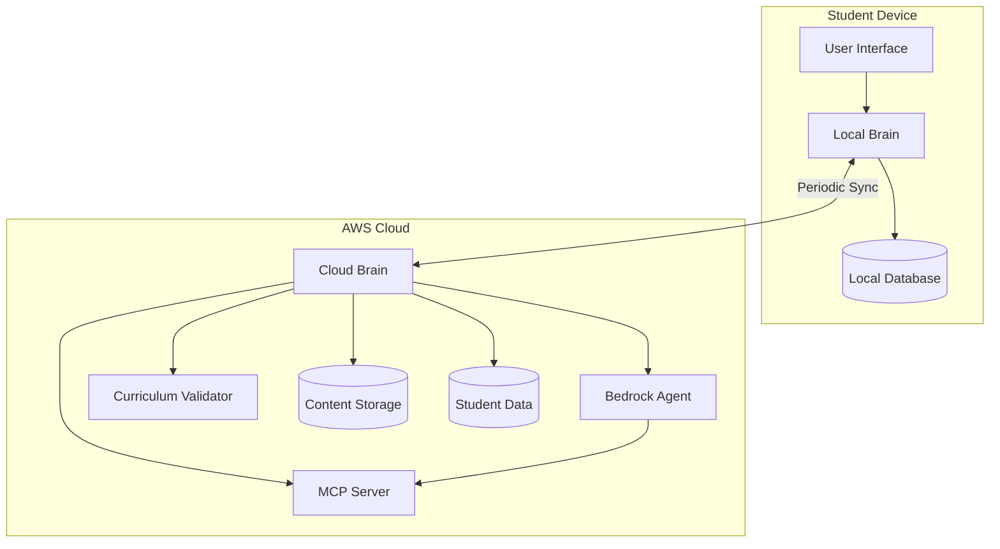
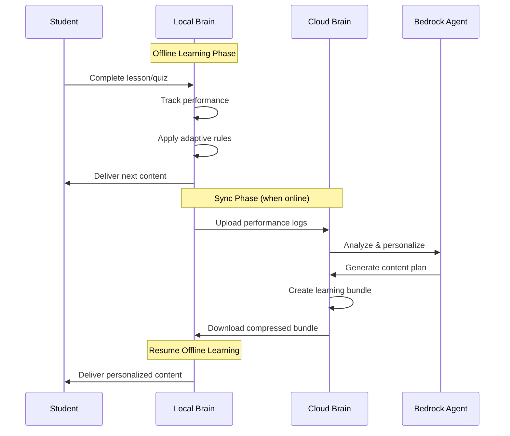

# Design Document: Sikshya-Sathi System

## Overview

Sikshya-Sathi is an offline-first agentic tutor system employing a two-brain architecture optimized for rural Nepal's infrastructure constraints. The Cloud Brain leverages Amazon Bedrock Agent for AI-powered personalization and content generation, while the Local Brain provides robust offline delivery and performance tracking on student devices. The system uses periodic synchronization with compressed learning bundles to balance personalization quality with bandwidth limitations.

### Design Principles

1. **Offline-First**: Local Brain operates independently for extended periods
2. **Bandwidth Efficiency**: Aggressive compression and delta synchronization
3. **Graceful Degradation**: System remains functional under resource constraints
4. **Safety by Design**: Multi-layer content validation and filtering
5. **Curriculum Fidelity**: Strict alignment with Nepal K-12 standards
6. **Scalability**: Cloud components scale horizontally to support thousands of students

## Architecture

### System Context



### Two-Brain Architecture

**Cloud Brain Responsibilities:**
- Content generation using Amazon Bedrock Agent
- Personalization engine and student modeling
- Curriculum integration via MCP Server
- Content validation and safety filtering
- Analytics and reporting
- Learning bundle packaging

**Local Brain Responsibilities:**
- Offline content delivery
- Quiz administration and immediate feedback
- Performance tracking and logging
- Adaptive content selection from bundles
- State persistence and recovery
- Sync orchestration

### Data Flow



## Components and Interfaces

### 1. Cloud Brain

#### 1.1 Amazon Bedrock Agent Integration

**Purpose**: AI-powered personalization and content generation engine

**Configuration**:
- Model: Claude 3.5 Sonnet (for reasoning and content generation)
- Agent Instructions: Specialized for educational content with Nepal curriculum context
- Action Groups: Content generation, personalization, curriculum alignment
- Knowledge Bases: Nepal K-12 curriculum standards, pedagogical best practices

**Agent Workflow**:
```
Input: Student performance logs + current knowledge model
↓
Bedrock Agent analyzes patterns and gaps
↓
Agent generates personalized content plan
↓
Agent creates lessons, quizzes, hints, revision materials
↓
Output: Structured learning bundle
```

**Action Groups**:

1. **GenerateLesson**
   - Input: Topic, skill level, cognitive level, student context
   - Output: Structured lesson with explanations, examples, practice problems
   - Validation: Curriculum alignment, age-appropriateness, language

2. **GenerateQuiz**
   - Input: Topic, difficulty, question count, learning objectives
   - Output: Quiz with questions, options, correct answers, explanations
   - Validation: Curriculum mapping, difficulty calibration

3. **GenerateHints**
   - Input: Quiz question, student error patterns
   - Output: Progressive hints from general to specific
   - Validation: Pedagogical soundness, no direct answers

4. **GenerateRevisionPlan**
   - Input: Student knowledge gaps, time available
   - Output: Prioritized revision schedule with content references
   - Validation: Realistic pacing, comprehensive coverage

5. **GenerateStudyTrack**
   - Input: Student profile, learning velocity, curriculum scope
   - Output: Multi-week learning path with milestones
   - Validation: Curriculum sequence, appropriate pacing

#### 1.2 MCP Server for Curriculum Integration

**Purpose**: Provide authoritative Nepal K-12 curriculum data to Bedrock Agent

**MCP Tools Exposed**:

1. **get_curriculum_standards**
   - Input: Grade, subject
   - Output: Learning objectives, topics, competencies
   
2. **get_topic_details**
   - Input: Topic ID
   - Output: Prerequisites, learning objectives, assessment criteria
   
3. **validate_content_alignment**
   - Input: Generated content, target standards
   - Output: Alignment score, gaps, recommendations
   
4. **get_learning_progression**
   - Input: Subject, grade range
   - Output: Topic sequence, dependencies, difficulty progression

**Data Schema**:
```typescript
interface CurriculumStandard {
  id: string;
  grade: number;
  subject: string;
  topic: string;
  learningObjectives: string[];
  prerequisites: string[];
  bloomLevel: 'remember' | 'understand' | 'apply' | 'analyze' | 'evaluate' | 'create';
  estimatedHours: number;
}
```

#### 1.3 Curriculum Validator

**Purpose**: Ensure all generated content meets Nepal K-12 standards

**Validation Pipeline**:
```
Generated Content
↓
1. Curriculum Alignment Check (MCP Server)
↓
2. Age-Appropriateness Check (Bedrock Agent)
↓
3. Language Appropriateness Check (Nepali context)
↓
4. Safety Filter (harmful content detection)
↓
5. Cultural Appropriateness Check (Nepal context)
↓
Approved Content → Learning Bundle
Rejected Content → Regenerate
```

**Validation Rules**:
- Content must map to specific curriculum standards (100% coverage)
- Language complexity must match grade level (Flesch-Kincaid)
- Examples must use culturally relevant contexts
- No religious, political, or culturally sensitive content
- Math problems use metric system and Nepali currency
- Science examples reference local flora, fauna, geography

#### 1.4 Content Generation Service

**Purpose**: Orchestrate Bedrock Agent to generate complete learning bundles

**API Interface**:
```typescript
interface ContentGenerationRequest {
  studentId: string;
  performanceLogs: PerformanceLog[];
  currentKnowledgeModel: KnowledgeModel;
  bundleDuration: number; // weeks
  subjects: string[];
}

interface LearningBundle {
  bundleId: string;
  studentId: string;
  validFrom: Date;
  validUntil: Date;
  subjects: SubjectContent[];
  totalSize: number; // bytes
  checksum: string;
}

interface SubjectContent {
  subject: string;
  lessons: Lesson[];
  quizzes: Quiz[];
  hints: HintMap;
  revisionPlan: RevisionPlan;
  studyTrack: StudyTrack;
}
```

**Generation Process**:
1. Receive performance logs from Local Brain
2. Update student knowledge model
3. Invoke Bedrock Agent with personalization context
4. Validate generated content through Curriculum Validator
5. Package content into compressed bundle
6. Store bundle in S3 with metadata in DynamoDB
7. Return bundle URL and checksum to Local Brain

#### 1.5 Personalization Engine

**Purpose**: Maintain student knowledge models and adapt content difficulty

**Knowledge Model**:
```typescript
interface KnowledgeModel {
  studentId: string;
  lastUpdated: Date;
  subjects: {
    [subject: string]: {
      topics: {
        [topicId: string]: {
          proficiency: number; // 0-1
          attempts: number;
          lastPracticed: Date;
          masteryLevel: 'novice' | 'developing' | 'proficient' | 'advanced';
          cognitiveLevel: number; // 1-6 (Bloom's)
        }
      };
      overallProficiency: number;
      learningVelocity: number; // topics per week
    }
  };
}
```

**Personalization Algorithm**:
1. Analyze performance logs for accuracy, time, and patterns
2. Update topic proficiency using Bayesian knowledge tracing
3. Identify knowledge gaps and mastery areas
4. Calculate optimal difficulty level (Zone of Proximal Development)
5. Generate content mix: 60% new material, 30% practice, 10% review
6. Adjust pacing based on learning velocity
7. Prioritize struggling topics for intervention

### 2. Local Brain

#### 2.1 Content Delivery Engine

**Purpose**: Deliver lessons and quizzes offline with smooth UX

**Architecture**:
```
UI Layer (React Native)
↓
Content Delivery Service
↓
Local Database (SQLite)
↓
File System (Compressed Assets)
```

**Content Loading Strategy**:
- Preload next 3 lessons in background
- Cache rendered content in memory
- Lazy load images and media
- Progressive rendering for large lessons

**API Interface**:
```typescript
interface ContentDeliveryService {
  getNextLesson(studentId: string, subject: string): Promise<Lesson>;
  getNextQuiz(studentId: string, subject: string): Promise<Quiz>;
  getHint(quizId: string, questionId: string, level: number): Promise<Hint>;
  markLessonComplete(lessonId: string, timeSpent: number): Promise<void>;
  submitQuizAnswer(quizId: string, questionId: string, answer: string): Promise<QuizFeedback>;
}
```

#### 2.2 Performance Tracking System

**Purpose**: Record all student interactions for personalization

**Tracked Events**:
```typescript
interface PerformanceLog {
  studentId: string;
  timestamp: Date;
  eventType: 'lesson_start' | 'lesson_complete' | 'quiz_start' | 'quiz_answer' | 'quiz_complete' | 'hint_requested';
  contentId: string;
  subject: string;
  topic: string;
  data: {
    timeSpent?: number;
    answer?: string;
    correct?: boolean;
    hintsUsed?: number;
    attempts?: number;
  };
}
```

**Storage Strategy**:
- Write logs to SQLite immediately (crash recovery)
- Batch logs for sync (reduce overhead)
- Compress logs before upload (gzip)
- Retain logs locally for 30 days (offline analytics)

#### 2.3 Adaptive Content Selection

**Purpose**: Select appropriate content from bundles based on recent performance

**Adaptive Rules**:
```typescript
interface AdaptiveRule {
  condition: (recentPerformance: PerformanceLog[]) => boolean;
  action: (availableContent: Content[]) => Content;
}

// Example Rules:
const rules: AdaptiveRule[] = [
  {
    // If student struggles (< 60% accuracy), provide easier content
    condition: (logs) => {
      const recent = logs.slice(-5);
      const accuracy = recent.filter(l => l.data.correct).length / recent.length;
      return accuracy < 0.6;
    },
    action: (content) => content.filter(c => c.difficulty === 'easy')[0]
  },
  {
    // If student excels (> 90% accuracy), skip to harder content
    condition: (logs) => {
      const recent = logs.slice(-5);
      const accuracy = recent.filter(l => l.data.correct).length / recent.length;
      return accuracy > 0.9;
    },
    action: (content) => content.filter(c => c.difficulty === 'hard')[0]
  },
  {
    // If student uses many hints, provide more practice
    condition: (logs) => {
      const recent = logs.slice(-3);
      const avgHints = recent.reduce((sum, l) => sum + (l.data.hintsUsed || 0), 0) / recent.length;
      return avgHints > 2;
    },
    action: (content) => content.filter(c => c.type === 'practice')[0]
  }
];
```

**Selection Algorithm**:
1. Retrieve last 10 performance logs for subject
2. Evaluate all adaptive rules
3. Apply highest priority matching rule
4. If no rules match, follow study track sequence
5. Mark selected content as "in progress"
6. Preload next content in background

#### 2.4 Sync Orchestrator

**Purpose**: Manage bidirectional synchronization with Cloud Brain

**Sync Protocol**:
```typescript
interface SyncSession {
  sessionId: string;
  startTime: Date;
  status: 'pending' | 'uploading' | 'downloading' | 'complete' | 'failed';
  upload: {
    performanceLogs: PerformanceLog[];
    compressedSize: number;
    checksum: string;
  };
  download: {
    bundleUrl: string;
    bundleSize: number;
    checksum: string;
  };
}
```

**Sync Workflow**:
```
1. Detect connectivity
↓
2. Compress performance logs (gzip)
↓
3. Upload logs to Cloud Brain
↓
4. Receive bundle URL and metadata
↓
5. Download bundle with resume support
↓
6. Verify checksum
↓
7. Decompress and import to local DB
↓
8. Mark old content as archived
↓
9. Update sync status
```

**Resume Support**:
- Use HTTP Range requests for partial downloads
- Store download progress in local DB
- Resume from last byte on connection restore
- Maximum 3 retry attempts with exponential backoff

**Bandwidth Optimization**:
- Delta sync: Only upload new logs since last sync
- Compression: gzip for logs, brotli for content
- Prioritization: Critical content first, media last
- Adaptive quality: Reduce image quality on slow connections

#### 2.5 Local Database Schema

**Purpose**: Store content, logs, and state for offline operation

**SQLite Schema**:
```sql
-- Content Tables
CREATE TABLE learning_bundles (
  bundle_id TEXT PRIMARY KEY,
  student_id TEXT NOT NULL,
  valid_from INTEGER NOT NULL,
  valid_until INTEGER NOT NULL,
  total_size INTEGER NOT NULL,
  checksum TEXT NOT NULL,
  status TEXT NOT NULL -- 'active', 'archived'
);

CREATE TABLE lessons (
  lesson_id TEXT PRIMARY KEY,
  bundle_id TEXT NOT NULL,
  subject TEXT NOT NULL,
  topic TEXT NOT NULL,
  difficulty TEXT NOT NULL,
  content_json TEXT NOT NULL, -- Compressed JSON
  estimated_minutes INTEGER NOT NULL,
  FOREIGN KEY (bundle_id) REFERENCES learning_bundles(bundle_id)
);

CREATE TABLE quizzes (
  quiz_id TEXT PRIMARY KEY,
  bundle_id TEXT NOT NULL,
  subject TEXT NOT NULL,
  topic TEXT NOT NULL,
  difficulty TEXT NOT NULL,
  questions_json TEXT NOT NULL, -- Compressed JSON
  FOREIGN KEY (bundle_id) REFERENCES learning_bundles(bundle_id)
);

CREATE TABLE hints (
  hint_id TEXT PRIMARY KEY,
  quiz_id TEXT NOT NULL,
  question_id TEXT NOT NULL,
  level INTEGER NOT NULL,
  hint_text TEXT NOT NULL,
  FOREIGN KEY (quiz_id) REFERENCES quizzes(quiz_id)
);

-- Performance Tables
CREATE TABLE performance_logs (
  log_id INTEGER PRIMARY KEY AUTOINCREMENT,
  student_id TEXT NOT NULL,
  timestamp INTEGER NOT NULL,
  event_type TEXT NOT NULL,
  content_id TEXT NOT NULL,
  subject TEXT NOT NULL,
  topic TEXT NOT NULL,
  data_json TEXT NOT NULL,
  synced INTEGER DEFAULT 0 -- 0 = not synced, 1 = synced
);

CREATE INDEX idx_logs_sync ON performance_logs(synced, timestamp);
CREATE INDEX idx_logs_student ON performance_logs(student_id, subject);

-- Sync Tables
CREATE TABLE sync_sessions (
  session_id TEXT PRIMARY KEY,
  start_time INTEGER NOT NULL,
  end_time INTEGER,
  status TEXT NOT NULL,
  logs_uploaded INTEGER DEFAULT 0,
  bundle_downloaded INTEGER DEFAULT 0,
  error_message TEXT
);

-- State Tables
CREATE TABLE student_state (
  student_id TEXT PRIMARY KEY,
  current_subject TEXT,
  current_lesson_id TEXT,
  last_active INTEGER NOT NULL
);
```

### 3. API Contracts

#### 3.1 Cloud Brain REST API

**Base URL**: `https://api.sikshya-sathi.np/v1`

**Authentication**: JWT tokens with student ID claims

**Endpoints**:

```typescript
// Upload performance logs
POST /sync/upload
Request: {
  studentId: string;
  logs: PerformanceLog[]; // compressed
  lastSyncTime: Date;
}
Response: {
  sessionId: string;
  logsReceived: number;
  bundleReady: boolean;
}

// Download learning bundle
GET /sync/download/:sessionId
Response: {
  bundleUrl: string; // S3 presigned URL
  bundleSize: number;
  checksum: string;
  validUntil: Date;
}

// Health check
GET /health
Response: {
  status: 'healthy' | 'degraded';
  version: string;
}
```

#### 3.2 Local Brain Internal API

```typescript
interface LocalBrainAPI {
  // Content Management
  loadBundle(bundleUrl: string): Promise<void>;
  getAvailableContent(subject: string): Promise<Content[]>;
  
  // Learning Flow
  startLesson(lessonId: string): Promise<Lesson>;
  completeLesson(lessonId: string, timeSpent: number): Promise<void>;
  startQuiz(quizId: string): Promise<Quiz>;
  submitAnswer(quizId: string, questionId: string, answer: string): Promise<QuizFeedback>;
  requestHint(quizId: string, questionId: string): Promise<Hint>;
  
  // Sync Management
  checkSyncNeeded(): Promise<boolean>;
  startSync(): Promise<SyncSession>;
  getSyncStatus(): Promise<SyncSession>;
  
  // State Management
  saveState(): Promise<void>;
  restoreState(): Promise<StudentState>;
}
```

## Data Models

### Content Models

```typescript
interface Lesson {
  lessonId: string;
  subject: string;
  topic: string;
  title: string;
  difficulty: 'easy' | 'medium' | 'hard';
  estimatedMinutes: number;
  curriculumStandards: string[];
  sections: LessonSection[];
}

interface LessonSection {
  type: 'explanation' | 'example' | 'practice';
  content: string; // Markdown
  media?: {
    type: 'image' | 'audio';
    url: string;
    alt?: string;
  }[];
}

interface Quiz {
  quizId: string;
  subject: string;
  topic: string;
  title: string;
  difficulty: 'easy' | 'medium' | 'hard';
  timeLimit?: number; // minutes
  questions: Question[];
}

interface Question {
  questionId: string;
  type: 'multiple_choice' | 'true_false' | 'short_answer';
  question: string;
  options?: string[]; // for multiple choice
  correctAnswer: string;
  explanation: string;
  curriculumStandard: string;
  bloomLevel: number;
}

interface Hint {
  hintId: string;
  level: number; // 1 = general, 2 = specific, 3 = very specific
  text: string;
}

interface StudyTrack {
  trackId: string;
  subject: string;
  weeks: WeekPlan[];
}

interface WeekPlan {
  weekNumber: number;
  topics: string[];
  lessons: string[]; // lesson IDs
  quizzes: string[]; // quiz IDs
  estimatedHours: number;
}
```

### Performance Models

```typescript
interface QuizFeedback {
  correct: boolean;
  explanation: string;
  nextHintLevel?: number;
  encouragement: string;
}

interface StudentProgress {
  studentId: string;
  subject: string;
  lessonsCompleted: number;
  quizzesCompleted: number;
  averageAccuracy: number;
  totalTimeSpent: number; // minutes
  currentStreak: number; // days
  topicsInProgress: string[];
  topicsMastered: string[];
}
```

## Correctness Properties

*A property is a characteristic or behavior that should hold true across all valid executions of a system—essentially, a formal statement about what the system should do. Properties serve as the bridge between human-readable specifications and machine-verifiable correctness guarantees.*


### Property 1: Content Curriculum Alignment

*For any* content generated by the Cloud Brain (lessons, quizzes, hints), the content must be validated by the Curriculum Validator and map to specific Nepal K-12 curriculum standards before being included in a Learning Bundle.

**Validates: Requirements 2.2, 2.10, 6.1, 6.2**

### Property 2: Personalized Content Generation

*For any* two students with different performance histories, the Cloud Brain shall generate different personalized lessons and study tracks that reflect their individual learning needs.

**Validates: Requirements 2.1, 5.1**

### Property 3: Contextual Hint Generation

*For any* quiz question, all generated hints must be contextually related to that specific question and provide progressive guidance without revealing the direct answer.

**Validates: Requirements 2.3**

### Property 4: MCP Server Integration

*For any* content generation request, the Cloud Brain must invoke the MCP Server to retrieve curriculum standards and validate alignment.

**Validates: Requirements 2.6**

### Property 5: Bundle Compression

*For any* Learning Bundle, the compressed size must not exceed 5MB per week of content, and the bundle must contain properly structured lessons, quizzes, and hints.

**Validates: Requirements 2.8, 4.4**

### Property 6: Offline Content Delivery

*For any* lesson or quiz in a synchronized Learning Bundle, the Local Brain must be able to deliver it without requiring internet connectivity.

**Validates: Requirements 3.1**

### Property 7: Local Performance Recording

*For any* student interaction (lesson completion, quiz answer, hint request), the Local Brain must create a Performance Log entry and persist it locally.

**Validates: Requirements 3.2, 3.4**

### Property 8: Content Cache Sufficiency

*For any* valid Learning Bundle loaded into the Local Brain, the cache must contain at least 2 weeks worth of learning content across all active subjects.

**Validates: Requirements 3.9**

### Property 9: Bidirectional Synchronization

*For any* completed Sync Session, the Local Brain must have successfully uploaded all pending Performance Logs to the Cloud Brain, and the Cloud Brain must have successfully downloaded a new Learning Bundle to the Local Brain.

**Validates: Requirements 4.2, 4.3**

### Property 10: Sync Resume Capability

*For any* interrupted Sync Session, when connectivity is restored, the system must resume from the last successful checkpoint and complete the synchronization without data loss.

**Validates: Requirements 4.6**

### Property 11: Sync Data Integrity

*For any* completed Sync Session, the downloaded bundle's checksum must match the expected checksum, and all uploaded logs must be acknowledged by the Cloud Brain.

**Validates: Requirements 4.8**

### Property 12: Adaptive Progression

*For any* student demonstrating mastery (>90% accuracy over 5 consecutive quizzes), the Cloud Brain must generate more challenging content in the next Learning Bundle.

**Validates: Requirements 5.4**

### Property 13: Knowledge Model Maintenance

*For any* Performance Log received by the Cloud Brain, the student's Knowledge Model must be updated to reflect the new proficiency data.

**Validates: Requirements 5.6**

### Property 14: Content Regeneration on Failure

*For any* content that fails Curriculum Validator checks, the Cloud Brain must regenerate the content until it passes validation or reaches a maximum retry limit.

**Validates: Requirements 6.5**

### Property 15: Validation Audit Trail

*For any* content validation attempt, the system must create an audit log entry recording the validation result, timestamp, and any issues found.

**Validates: Requirements 6.8**

### Property 16: Safety Content Filtering

*For any* content generated by the Cloud Brain, if unsafe or inappropriate material is detected, the content must be rejected and regenerated until it passes safety filters.

**Validates: Requirements 7.1, 7.4**

### Property 17: Content Signature Verification

*For any* content accepted by the Local Brain, it must have a valid cryptographic signature from the Cloud Brain, and unsigned content must be rejected.

**Validates: Requirements 7.7**

### Property 18: Aggressive State Persistence

*For any* 30-second interval during active use, the Local Brain must persist the current student progress to local storage to prevent data loss.

**Validates: Requirements 8.8, 11.6**

### Property 19: Crash Recovery

*For any* Local Brain crash or unexpected termination, when the application restarts, it must restore to the last persisted state with no loss of student progress.

**Validates: Requirements 8.9**

### Property 20: Performance Log Encryption

*For any* Performance Log stored locally or transmitted during sync, the data must be encrypted using AES-256 encryption.

**Validates: Requirements 9.1**

### Property 21: Secure Sync Transmission

*For any* Sync Session, all data transmission between Local Brain and Cloud Brain must use TLS 1.3 protocol.

**Validates: Requirements 9.5**

### Property 22: Data Export Functionality

*For any* student or parent request, the system must be able to export all student learning data in a human-readable format.

**Validates: Requirements 9.7**

### Property 23: Extended Offline Operation

*For any* Local Brain with a valid Learning Bundle, the system must continue functioning without internet connectivity for at least 2 weeks (14 days) of typical daily usage.

**Validates: Requirements 11.1**

### Property 24: Delta Synchronization

*For any* Sync Session, only Performance Logs created since the last successful sync must be uploaded (delta sync), not the entire log history.

**Validates: Requirements 11.4**

### Property 25: Educator Study Track Assignment

*For any* educator assignment of a specific topic or study track to a student, the assignment must be reflected in the student's next Learning Bundle.

**Validates: Requirements 14.2, 14.7**

### Property 26: Devanagari Script Rendering

*For any* content containing Nepali text in Devanagari script, the Local Brain must render the text correctly without character corruption or display errors.

**Validates: Requirements 15.3**

### Property 27: Curriculum Terminology Consistency

*For any* content generated by the Cloud Brain, all technical and subject-specific terms must match the official Nepal K-12 curriculum terminology.

**Validates: Requirements 15.7**

## Error Handling

### Cloud Brain Error Handling

**Content Generation Failures**:
- Bedrock Agent timeout (>30s): Retry with exponential backoff (max 3 attempts)
- Invalid content generated: Trigger Curriculum Validator, regenerate if fails
- MCP Server unavailable: Use cached curriculum data, flag for manual review
- Validation failures: Log error, regenerate with adjusted prompts

**Sync Failures**:
- Student data not found: Return error, request re-authentication
- Bundle generation timeout: Queue for async processing, notify when ready
- S3 upload failure: Retry with exponential backoff, use backup storage

**Error Response Format**:
```typescript
interface ErrorResponse {
  errorCode: string;
  message: string;
  retryable: boolean;
  retryAfter?: number; // seconds
  details?: Record<string, any>;
}
```

### Local Brain Error Handling

**Offline Operation Errors**:
- Content not found: Display friendly message, suggest sync
- Corrupted bundle: Validate checksum, re-download if possible
- Database errors: Attempt recovery, fallback to read-only mode
- Storage full: Prompt to archive old content, free space

**Sync Errors**:
- Network timeout: Retry with exponential backoff (max 3 attempts)
- Checksum mismatch: Re-download bundle from last checkpoint
- Upload failure: Queue logs for next sync, continue operation
- Authentication failure: Prompt for re-login

**Crash Recovery**:
- On startup, check for incomplete operations
- Restore from last persisted state
- Validate database integrity
- Resume any interrupted syncs

**Graceful Degradation**:
- Low memory: Reduce cache size, unload unused content
- Low battery: Disable background sync, reduce animations
- Slow device: Simplify UI, disable non-essential features

### Error Logging

**Local Brain Logs**:
```typescript
interface ErrorLog {
  timestamp: Date;
  errorType: 'network' | 'storage' | 'content' | 'system';
  severity: 'low' | 'medium' | 'high' | 'critical';
  message: string;
  stackTrace?: string;
  context: Record<string, any>;
}
```

**Cloud Brain Logs**:
- CloudWatch Logs for all API requests
- Separate log groups for content generation, validation, sync
- Structured logging with correlation IDs
- Alert on critical errors (validation failures, security issues)

## Testing Strategy

### Dual Testing Approach

The Sikshya-Sathi system requires both unit testing and property-based testing for comprehensive coverage:

**Unit Tests**: Focus on specific examples, edge cases, and integration points
- Specific content generation scenarios
- Edge cases (empty bundles, corrupted data, network failures)
- Integration between Cloud Brain components
- UI component behavior
- Database operations

**Property-Based Tests**: Verify universal properties across all inputs
- Content validation properties (all content meets curriculum standards)
- Sync properties (data integrity, resume capability)
- Personalization properties (different students get different content)
- Security properties (encryption, signatures)
- Offline operation properties (extended operation without connectivity)

Both approaches are complementary and necessary. Unit tests catch concrete bugs in specific scenarios, while property-based tests verify general correctness across the input space.

### Property-Based Testing Configuration

**Framework Selection**:
- **Cloud Brain (Python)**: Use `hypothesis` library
- **Local Brain (TypeScript/React Native)**: Use `fast-check` library

**Test Configuration**:
- Minimum 100 iterations per property test (due to randomization)
- Each property test must reference its design document property
- Tag format: `Feature: sikshya-sathi-system, Property {number}: {property_text}`

**Example Property Test Structure**:

```python
# Cloud Brain - Python with hypothesis
from hypothesis import given, strategies as st
import pytest

@given(
    performance_logs=st.lists(st.builds(PerformanceLog)),
    student_id=st.text(min_size=1)
)
@pytest.mark.property_test
@pytest.mark.tag("Feature: sikshya-sathi-system, Property 2: Personalized Content Generation")
def test_personalized_content_generation(performance_logs, student_id):
    """
    Property 2: For any two students with different performance histories,
    the Cloud Brain shall generate different personalized lessons.
    """
    # Generate content for student 1
    bundle1 = cloud_brain.generate_bundle(student_id + "_1", performance_logs)
    
    # Generate content for student 2 with different performance
    different_logs = modify_performance(performance_logs)
    bundle2 = cloud_brain.generate_bundle(student_id + "_2", different_logs)
    
    # Assert bundles are different (personalized)
    assert bundle1.lessons != bundle2.lessons
    assert bundle1.study_track != bundle2.study_track
```

```typescript
// Local Brain - TypeScript with fast-check
import fc from 'fast-check';
import { describe, it } from '@jest/globals';

describe('Property 7: Local Performance Recording', () => {
  it('should record all student interactions locally', () => {
    fc.assert(
      fc.property(
        fc.record({
          studentId: fc.string(),
          eventType: fc.constantFrom('lesson_complete', 'quiz_answer', 'hint_requested'),
          contentId: fc.string(),
          subject: fc.string(),
          data: fc.object()
        }),
        async (interaction) => {
          // Feature: sikshya-sathi-system, Property 7: Local Performance Recording
          
          // Perform interaction
          await localBrain.recordInteraction(interaction);
          
          // Verify log was created
          const logs = await localBrain.getPerformanceLogs(interaction.studentId);
          const matchingLog = logs.find(log => 
            log.contentId === interaction.contentId &&
            log.eventType === interaction.eventType
          );
          
          expect(matchingLog).toBeDefined();
          expect(matchingLog.synced).toBe(false);
        }
      ),
      { numRuns: 100 }
    );
  });
});
```

### Unit Testing Strategy

**Cloud Brain Unit Tests**:
- Bedrock Agent action group handlers
- MCP Server tool implementations
- Curriculum Validator logic
- Content compression and packaging
- Error handling and retry logic
- Authentication and authorization

**Local Brain Unit Tests**:
- Content delivery service
- Adaptive rule evaluation
- Sync orchestrator state machine
- Database operations (CRUD)
- UI component rendering
- Crash recovery logic

**Integration Tests**:
- End-to-end sync flow
- Content generation to delivery pipeline
- Authentication flow
- Educator assignment propagation

### Test Data Generation

**Curriculum Data**:
- Use actual Nepal K-12 curriculum standards
- Generate synthetic student performance data
- Create representative lesson and quiz content

**Performance Scenarios**:
- Struggling student (low accuracy, slow progress)
- Excelling student (high accuracy, fast progress)
- Inconsistent student (variable performance)
- New student (no history)

### Testing Environments

**Local Development**:
- Mock Bedrock Agent responses
- Local SQLite database
- Simulated network conditions

**Staging**:
- Real Bedrock Agent (dev account)
- Test MCP Server with curriculum data
- Simulated rural Nepal network (2G speeds, high latency)

**Production**:
- Full monitoring and alerting
- Canary deployments
- A/B testing for personalization algorithms

### Performance Testing

**Load Testing**:
- Simulate 10,000 concurrent students
- Measure Cloud Brain response times
- Test sync throughput

**Stress Testing**:
- Test Local Brain with minimal resources (2GB RAM)
- Test with poor connectivity (2G, high packet loss)
- Test with low battery conditions

**Endurance Testing**:
- Run Local Brain for 2 weeks offline
- Verify no memory leaks
- Verify database performance over time

## Implementation Notes

### Technology Stack

**Cloud Brain**:
- Runtime: AWS Lambda (Python 3.11)
- AI: Amazon Bedrock (Claude 3.5 Sonnet)
- Storage: Amazon S3 (content), DynamoDB (metadata)
- API: API Gateway with Lambda integration
- Monitoring: CloudWatch, X-Ray

**Local Brain**:
- Framework: React Native (cross-platform)
- Database: SQLite with encryption
- State Management: Redux with persistence
- Networking: Axios with retry logic
- Testing: Jest, fast-check

**MCP Server**:
- Runtime: Node.js
- Data: JSON files with curriculum standards
- Protocol: Model Context Protocol

### Deployment Architecture

**Cloud Brain**:
```
Internet Gateway
↓
API Gateway (REST API)
↓
Lambda Functions (Content Generation, Sync, Validation)
↓
Bedrock Agent ← MCP Server
↓
S3 (Bundles) + DynamoDB (Metadata)
```

**Local Brain**:
```
React Native App
↓
Local Services Layer
↓
SQLite Database + File System
↓
Device Hardware (Storage, Network)
```

### Security Considerations

**Authentication**:
- JWT tokens with 24-hour expiry
- Refresh tokens stored securely on device
- Device fingerprinting for anomaly detection

**Content Signing**:
- Cloud Brain signs all bundles with RSA-2048
- Local Brain verifies signatures before import
- Prevents tampering and unauthorized content

**Data Protection**:
- AES-256 encryption for local database
- TLS 1.3 for all network communication
- No PII in logs or analytics

### Monitoring and Observability

**Cloud Brain Metrics**:
- Content generation latency (p50, p95, p99)
- Validation success rate
- Sync completion rate
- Bedrock Agent token usage
- Error rates by type

**Local Brain Metrics**:
- App crashes and ANRs
- Sync success rate
- Offline operation duration
- Storage usage
- Battery impact

**Alerts**:
- Validation failure rate > 5%
- Sync failure rate > 10%
- Content generation latency > 60s
- Critical errors in production

### Scalability Considerations

**Horizontal Scaling**:
- Lambda auto-scales to handle load
- DynamoDB on-demand capacity
- S3 handles unlimited storage

**Cost Optimization**:
- Cache curriculum data to reduce MCP calls
- Batch Bedrock Agent requests
- Compress bundles aggressively
- Use S3 lifecycle policies for old content

**Performance Optimization**:
- CDN for bundle distribution (CloudFront)
- Regional endpoints for lower latency
- Async content generation with queues
- Database indexing for fast queries

## Future Enhancements

### Phase 2 Features

1. **Peer Learning**: Connect students for collaborative problem-solving
2. **Voice Interface**: Audio lessons and voice-based quiz answers
3. **Offline Video**: Compressed video lessons in bundles
4. **Parent Dashboard**: Web portal for parents to track progress
5. **Gamification**: Badges, streaks, and leaderboards

### Phase 3 Features

1. **Live Tutoring**: Connect students with human tutors when online
2. **Advanced Analytics**: ML-powered learning gap prediction
3. **Adaptive Assessments**: Dynamic difficulty adjustment during quizzes
4. **Multi-Language**: Support for additional Nepali regional languages
5. **Accessibility**: Screen reader support, high contrast mode

### Research Opportunities

1. **Offline AI**: Explore on-device LLMs for content generation
2. **Mesh Networking**: Student devices share content peer-to-peer
3. **Low-Bandwidth Protocols**: Custom protocols for 2G optimization
4. **Curriculum Mining**: Automated extraction from textbooks
5. **Learning Science**: A/B test personalization strategies
