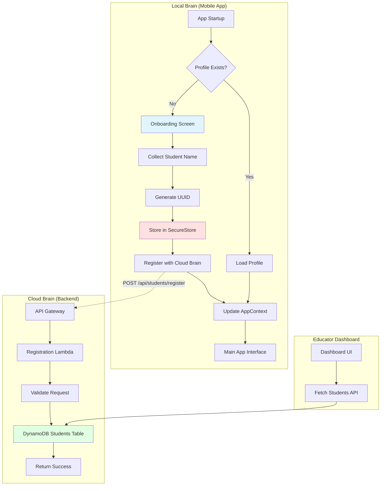
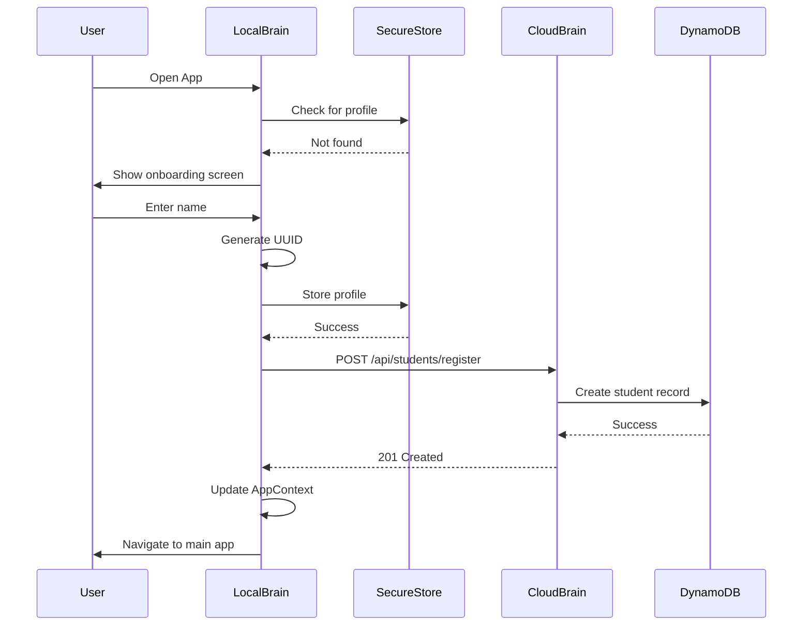
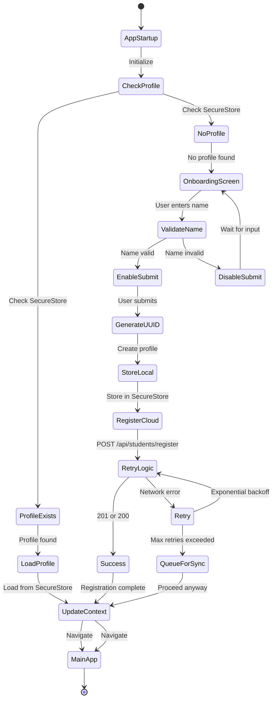
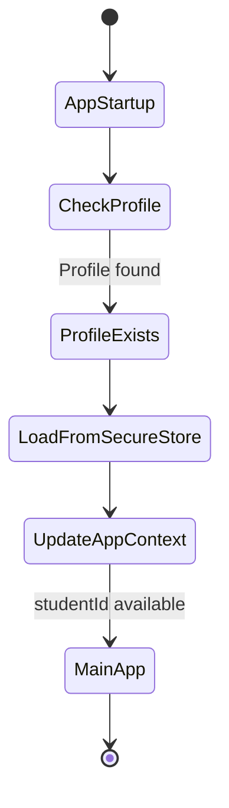

# Design Document: Student Identification and Registration

## Overview

The Student Identification and Registration feature introduces persistent student identity management to the Sikshya-Sathi system. This design replaces hardcoded demo student IDs with real, unique identifiers (UUIDs) that enable proper data isolation, progress tracking, and multi-student support.

The system follows a two-brain architecture:
- **Local Brain (Mobile App)**: Detects first launch, collects student name, generates UUID, stores profile in SecureStore, and registers with Cloud Brain
- **Cloud Brain (Backend API)**: Provides registration endpoint, stores student records in DynamoDB, and serves educator dashboard

Key design principles:
- **Offline-first**: UUID generation happens locally without requiring network connectivity
- **Resilient registration**: Retry logic with exponential backoff handles network failures
- **Security**: Student profiles stored using Expo SecureStore with device keychain encryption
- **Idempotent operations**: Registration endpoint handles duplicate requests gracefully
- **Future-ready**: Data structures designed to support multiple student profiles per device

## Architecture

### System Components



### Component Interactions

1. **First Launch Detection**
   - App startup checks SecureStore for existing student profile
   - If not found, displays onboarding screen
   - If found, loads profile into AppContext and proceeds to main interface

2. **Profile Creation Flow**
   - User enters name on onboarding screen
   - Local Brain generates UUID v4 using crypto-secure random
   - Profile (studentId + studentName) stored in SecureStore
   - Registration request sent to Cloud Brain
   - On success or after retries, AppContext updated with student identity

3. **Cloud Registration Flow**
   - API Gateway receives POST request at `/api/students/register`
   - Lambda validates UUID format and student name
   - DynamoDB stores student record with registration timestamp
   - Idempotent: duplicate studentId returns 200 (already exists)
   - Returns 201 for new registrations

4. **AppContext Integration**
   - AppContext provides studentId to all components
   - All data operations (lessons, quizzes, progress) use studentId from context
   - Replaces hardcoded `SAMPLE_STUDENT_ID` throughout codebase

### Data Flow



## Components and Interfaces

### Local Brain Components

#### 1. OnboardingScreen Component

**Location**: `local-brain/app/onboarding.tsx`

**Responsibilities**:
- Display welcome message and name input field
- Validate student name (non-empty, non-whitespace)
- Enable/disable submit button based on validation
- Trigger profile creation on submit

**Interface**:
```typescript
interface OnboardingScreenProps {
  onComplete: (profile: StudentProfile) => void;
}

interface OnboardingScreenState {
  studentName: string;
  isSubmitting: boolean;
  error: string | null;
}
```

**UI Elements**:
- Welcome text explaining the app
- Text input for student name
- Submit button (disabled when name is invalid)
- Loading indicator during registration
- Error message display for registration failures

#### 2. StudentProfileService

**Location**: `local-brain/src/services/StudentProfileService.ts`

**Responsibilities**:
- Check for existing profile in SecureStore
- Generate UUID v4 for new students
- Store and retrieve profiles from SecureStore
- Register student with Cloud Brain API
- Handle retry logic with exponential backoff

**Interface**:
```typescript
interface StudentProfile {
  studentId: string;  // UUID v4
  studentName: string;
}

class StudentProfileService {
  // Check if profile exists
  async hasProfile(): Promise<boolean>;
  
  // Load existing profile
  async loadProfile(): Promise<StudentProfile | null>;
  
  // Create new profile (generate UUID, store locally, register with cloud)
  async createProfile(studentName: string): Promise<StudentProfile>;
  
  // Store profile in SecureStore
  private async storeProfile(profile: StudentProfile): Promise<void>;
  
  // Register with Cloud Brain (with retry logic)
  private async registerWithCloudBrain(profile: StudentProfile): Promise<void>;
  
  // Generate UUID v4
  private generateStudentId(): string;
}
```

**SecureStore Keys**:
- `sikshya_sathi_student_profile`: JSON string containing StudentProfile

**Retry Configuration**:
- Max retries: 3
- Backoff delays: 1s, 2s, 4s (exponential)
- On final failure: log error, queue for next sync, proceed to app

#### 3. AppContext Updates

**Location**: `local-brain/src/contexts/AppContext.tsx`

**Changes**:
- Replace hardcoded `SAMPLE_STUDENT_ID` with dynamic `studentId` state
- Add `setStudentId` function to update context
- Initialize studentId from StudentProfileService on app startup
- Provide studentId to all child components

**Updated Interface**:
```typescript
interface AppContextType {
  // ... existing fields
  studentId: string | null;  // Changed from hardcoded constant
  setStudentId: (id: string) => void;  // New setter
  isProfileLoaded: boolean;  // New flag
}
```

### Cloud Brain Components

#### 1. Registration API Endpoint

**Endpoint**: `POST /api/students/register`

**Handler**: `cloud-brain/src/handlers/student_handler.py`

**Request Schema**:
```json
{
  "studentId": "550e8400-e29b-41d4-a716-446655440000",
  "studentName": "Rajesh Kumar"
}
```

**Response Schema (201 Created)**:
```json
{
  "studentId": "550e8400-e29b-41d4-a716-446655440000",
  "studentName": "Rajesh Kumar",
  "registrationTimestamp": "2024-01-15T10:30:00Z",
  "status": "registered"
}
```

**Response Schema (200 OK - Already Exists)**:
```json
{
  "studentId": "550e8400-e29b-41d4-a716-446655440000",
  "studentName": "Rajesh Kumar",
  "registrationTimestamp": "2024-01-10T08:15:00Z",
  "status": "already_registered"
}
```

**Error Response (400 Bad Request)**:
```json
{
  "error": "INVALID_REQUEST",
  "message": "Invalid UUID format for studentId",
  "retryable": false
}
```

**HTTP Status Codes**:
- `201 Created`: New student successfully registered
- `200 OK`: Student already exists (idempotent operation)
- `400 Bad Request`: Invalid input (malformed UUID, empty name, missing fields)
- `503 Service Unavailable`: DynamoDB error (retryable)
- `500 Internal Server Error`: Unexpected error (retryable)

**Validation Rules**:
- `studentId`: Must be valid UUID v4 format (8-4-4-4-12 hex pattern)
- `studentName`: Must be non-empty string after trimming whitespace, max 100 characters
- Both fields required

**Handler Logic**:
```python
def register(event: dict, context: LambdaContext) -> dict:
    # 1. Parse request body
    # 2. Validate studentId (UUID v4 format)
    # 3. Validate studentName (non-empty, max length)
    # 4. Check if student already exists (idempotent check)
    # 5. If exists, return 200 with existing record
    # 6. If not exists, create DynamoDB record with timestamp
    # 7. Return 201 with created record
    # 8. Handle errors with appropriate status codes
```

**CORS Headers**:
```
Access-Control-Allow-Origin: *
Access-Control-Allow-Methods: POST, OPTIONS
Access-Control-Allow-Headers: Content-Type, Authorization
```

#### 2. Students Repository

**Location**: `cloud-brain/src/repositories/student_repository.py`

**Interface**:
```python
class StudentRepository:
    def __init__(self):
        self.table_name = os.environ.get("STUDENTS_TABLE")
        self.table = dynamodb.Table(self.table_name)
    
    def create_student(self, student_id: str, student_name: str) -> Student:
        """Create new student record (idempotent)"""
        
    def get_student(self, student_id: str) -> Optional[Student]:
        """Retrieve student by ID"""
        
    def list_students(self, limit: int = 100) -> List[Student]:
        """List all students (for educator dashboard)"""
        
    def student_exists(self, student_id: str) -> bool:
        """Check if student exists"""
```

#### 3. Educator Dashboard Integration

**Endpoint**: `GET /api/educator/students`

**Changes**:
- Remove mock data generation
- Query DynamoDB students table
- Return real student records with registration timestamps
- Support pagination for large student lists

## Data Models

### Local Brain Models

#### StudentProfile (TypeScript)

```typescript
interface StudentProfile {
  studentId: string;      // UUID v4 format
  studentName: string;    // Student's name
  createdAt?: string;     // ISO 8601 timestamp (optional, for future use)
}
```

**Storage Format** (SecureStore):
```json
{
  "studentId": "550e8400-e29b-41d4-a716-446655440000",
  "studentName": "Rajesh Kumar",
  "createdAt": "2024-01-15T10:30:00Z"
}
```

### Cloud Brain Models

#### Student (Python/Pydantic)

```python
from pydantic import BaseModel, Field
from datetime import datetime
from typing import Optional

class Student(BaseModel):
    student_id: str = Field(..., description="UUID v4 identifier")
    student_name: str = Field(..., description="Student name", max_length=100)
    registration_timestamp: datetime = Field(
        default_factory=datetime.utcnow,
        description="When student registered"
    )
    last_sync_time: Optional[datetime] = Field(
        None,
        description="Last successful sync timestamp"
    )
    total_lessons_completed: int = Field(
        default=0,
        description="Total lessons completed"
    )
    total_quizzes_completed: int = Field(
        default=0,
        description="Total quizzes completed"
    )

class StudentRegistrationRequest(BaseModel):
    student_id: str = Field(..., description="UUID v4 identifier")
    student_name: str = Field(..., description="Student name", max_length=100)

class StudentRegistrationResponse(BaseModel):
    student_id: str
    student_name: str
    registration_timestamp: datetime
    status: str  # "registered" or "already_registered"
```

## Database Schemas

### DynamoDB: Students Table

**Table Name**: `sikshya-sathi-students-{environment}`

**Primary Key**:
- Partition Key: `studentId` (String) - UUID v4

**Attributes**:
```
{
  "studentId": "550e8400-e29b-41d4-a716-446655440000",  // PK
  "studentName": "Rajesh Kumar",
  "registrationTimestamp": "2024-01-15T10:30:00Z",
  "lastSyncTime": "2024-01-20T14:45:00Z",              // Optional
  "totalLessonsCompleted": 15,                          // Default: 0
  "totalQuizzesCompleted": 8,                           // Default: 0
  "metadata": {                                         // Optional
    "deviceInfo": "iOS 17.2",
    "appVersion": "1.0.0"
  }
}
```

**Indexes**: None required (simple key-value lookups by studentId)

**Capacity**: Pay-per-request billing mode

**Backup**: Point-in-time recovery enabled for production

### SecureStore: Student Profile

**Key**: `sikshya_sathi_student_profile`

**Value**: JSON string
```json
{
  "studentId": "550e8400-e29b-41d4-a716-446655440000",
  "studentName": "Rajesh Kumar",
  "createdAt": "2024-01-15T10:30:00Z"
}
```

**Security**:
- Stored in device keychain (iOS) or Keystore (Android)
- Encrypted at rest by OS
- Accessible only when device unlocked (`WHEN_UNLOCKED` policy)
- Not backed up to cloud (secure by default)

### SQLite: Data Isolation Updates

**Existing Tables**: All tables already have `studentId` column

**Changes Required**:
- Update all INSERT operations to use `studentId` from AppContext
- Update all SELECT operations to filter by `studentId` from AppContext
- No schema changes needed (tables already designed for multi-student support)

**Example Query Updates**:
```typescript
// Before (hardcoded)
const lessons = await db.executeSql(
  'SELECT * FROM lessons WHERE studentId = ?',
  [SAMPLE_STUDENT_ID]
);

// After (from AppContext)
const { studentId } = useApp();
const lessons = await db.executeSql(
  'SELECT * FROM lessons WHERE studentId = ?',
  [studentId]
);
```

## UI Flow Diagrams

### First Launch Flow



### Onboarding Screen Wireframe

```
┌─────────────────────────────────────┐
│  Sikshya-Sathi                      │
│                                     │
│  Welcome to Sikshya-Sathi!          │
│                                     │
│  Let's get started by creating      │
│  your learning profile.             │
│                                     │
│  ┌───────────────────────────────┐ │
│  │ Enter your name               │ │
│  │ [Rajesh Kumar____________]    │ │
│  └───────────────────────────────┘ │
│                                     │
│  ┌───────────────────────────────┐ │
│  │      Get Started              │ │
│  └───────────────────────────────┘ │
│                                     │
│  [Loading indicator if submitting] │
│  [Error message if registration    │
│   fails after retries]             │
└─────────────────────────────────────┘
```

### Returning User Flow




## Integration Points with Existing AppContext

### Current AppContext Structure

The existing AppContext uses a hardcoded `SAMPLE_STUDENT_ID` constant. The integration requires:

1. **Replace Static ID with Dynamic State**
   ```typescript
   // Before
   studentId: SAMPLE_STUDENT_ID,
   
   // After
   const [studentId, setStudentId] = useState<string | null>(null);
   const [isProfileLoaded, setIsProfileLoaded] = useState(false);
   ```

2. **Initialize from StudentProfileService**
   ```typescript
   useEffect(() => {
     const initializeProfile = async () => {
       const profileService = StudentProfileService.getInstance();
       const profile = await profileService.loadProfile();
       
       if (profile) {
         setStudentId(profile.studentId);
         setIsProfileLoaded(true);
       } else {
         // Navigate to onboarding
         router.push('/onboarding');
       }
     };
     
     initializeProfile();
   }, []);
   ```

3. **Update All Service Initializations**
   - StatePersistenceService: Change from `initialize(SAMPLE_STUDENT_ID)` to `initialize(studentId)`
   - Wait for `isProfileLoaded` before initializing services
   - Show loading screen while profile is being loaded

### Migration Strategy

1. **Phase 1**: Add StudentProfileService and onboarding screen
2. **Phase 2**: Update AppContext to use dynamic studentId
3. **Phase 3**: Update all components to handle null studentId during loading
4. **Phase 4**: Remove SAMPLE_STUDENT_ID constant
5. **Phase 5**: Test with multiple student profiles (future)

## Correctness Properties

*A property is a characteristic or behavior that should hold true across all valid executions of a system—essentially, a formal statement about what the system should do. Properties serve as the bridge between human-readable specifications and machine-verifiable correctness guarantees.*

### Property Reflection

After analyzing all acceptance criteria, I identified the following redundancies:

**Redundancy Analysis**:
1. Properties 3.1 and 3.2 (UUID generation and format validation) can be combined - if we generate a UUID v4, it will always be in valid format
2. Properties 4.1 and 4.2 (storing profile and storing both fields) can be combined - storing a profile inherently means storing all its fields
3. Properties 7.1, 7.2, 7.3 (data isolation for bundles, quizzes, logs) can be combined into one comprehensive data isolation property
4. Properties 8.2 and 8.3 (validating studentId and studentName) can be combined into one validation property
5. Properties 8.5 and 8.7 (creating record with fields and returning 201) can be combined - successful creation includes both

**Consolidated Properties**: The following properties represent unique validation requirements without redundancy.

### Property 1: Profile Existence Check on Startup

*For any* app startup, the system should check SecureStore for an existing profile and either load it into AppContext or navigate to onboarding based on whether a profile exists.

**Validates: Requirements 1.1, 1.3**

### Property 2: Profile Load Round Trip

*For any* student profile stored in SecureStore, loading the profile should retrieve a profile with the same studentId and studentName that was originally stored.

**Validates: Requirements 4.1, 4.2**

### Property 3: Name Validation Controls Submit Button

*For any* input string, the submit button should be enabled if and only if the string contains at least one non-whitespace character.

**Validates: Requirements 2.3, 2.4**

### Property 4: UUID Generation Format

*For any* profile creation, the generated studentId should be a valid UUID v4 format matching the pattern 8-4-4-4-12 hexadecimal characters.

**Validates: Requirements 3.1, 3.2**

### Property 5: UUID Uniqueness

*For any* two profile creations, the generated studentIds should be different (collision probability < 1 in 10^36).

**Validates: Requirements 3.3**

### Property 6: Profile Retrieval Performance

*For any* app startup with an existing profile, retrieving the profile from SecureStore should complete within 500ms.

**Validates: Requirements 4.4**

### Property 7: Registration Request Completeness

*For any* profile creation, the registration request sent to the Cloud Brain should include both studentId and studentName fields.

**Validates: Requirements 5.1, 5.2**

### Property 8: Registration Retry Logic

*For any* failed registration request, the system should retry up to 3 times with exponential backoff delays of 1s, 2s, and 4s before proceeding.

**Validates: Requirements 5.5**

### Property 9: AppContext Population

*For any* profile load operation, the AppContext should be updated with the studentId from the loaded profile.

**Validates: Requirements 6.1**

### Property 10: API Calls Include Student ID

*For any* API call to Cloud Brain, the request should include the studentId from AppContext.

**Validates: Requirements 6.4**

### Property 11: Data Isolation

*For any* local data storage operation (lesson bundles, quiz results, progress logs), the data should be associated with the studentId from AppContext.

**Validates: Requirements 7.1, 7.2, 7.3, 7.4**

### Property 12: Cloud Data Partitioning

*For any* student data stored in DynamoDB, the data should be partitioned by studentId.

**Validates: Requirements 7.5**

### Property 13: Registration Input Validation

*For any* registration request, the Cloud Brain should validate that studentId is a valid UUID format and studentName is a non-empty string, returning 400 if validation fails.

**Validates: Requirements 8.2, 8.3, 8.4**

### Property 14: Successful Registration Response

*For any* valid registration request for a new student, the Cloud Brain should create a DynamoDB record with studentId, studentName, and registrationTimestamp, and return HTTP status 201 with the created record.

**Validates: Requirements 5.3, 5.4, 8.5, 8.7**

### Property 15: Registration Idempotency

*For any* registration request with a studentId that already exists in DynamoDB, the Cloud Brain should return HTTP status 200 without creating a duplicate record.

**Validates: Requirements 8.6**

### Property 16: Educator Dashboard Data Completeness

*For any* student record returned by the educator dashboard API, the response should include studentId, studentName, and registrationTimestamp.

**Validates: Requirements 10.3**

### Property 17: Progress Data Isolation

*For any* progress data fetch for the educator dashboard, the Cloud Brain should filter data by the correct studentId.

**Validates: Requirements 10.4**

## Error Handling

### Local Brain Error Scenarios

#### 1. SecureStore Access Failure

**Scenario**: Device keychain is locked or SecureStore API fails

**Handling**:
- Catch exception during profile load
- Show error message: "Unable to access secure storage. Please unlock your device."
- Retry after 2 seconds
- After 3 retries, show onboarding screen (treat as no profile)

**Code Pattern**:
```typescript
try {
  const profile = await SecureStore.getItemAsync(PROFILE_KEY);
} catch (error) {
  console.error('SecureStore access failed:', error);
  // Retry logic
}
```

#### 2. UUID Generation Failure

**Scenario**: Crypto API unavailable or fails

**Handling**:
- Catch exception during UUID generation
- Log error with device info
- Retry with fallback UUID generation method
- Show error message if all methods fail: "Unable to create profile. Please try again."

**Fallback Strategy**:
1. Primary: `expo-crypto` randomUUID
2. Fallback: Manual UUID v4 generation using `expo-crypto` random bytes
3. Last resort: Timestamp + random string (with warning logged)

#### 3. Registration Network Failure

**Scenario**: No internet connection or API unreachable

**Handling**:
- Implement exponential backoff retry (1s, 2s, 4s)
- After 3 retries, proceed to main app
- Queue registration for next sync operation
- Show non-blocking notification: "Profile saved locally. Will sync when online."

**Retry Logic**:
```typescript
async function registerWithRetry(profile: StudentProfile, maxRetries = 3) {
  for (let attempt = 0; attempt < maxRetries; attempt++) {
    try {
      await registerAPI(profile);
      return { success: true };
    } catch (error) {
      if (attempt < maxRetries - 1) {
        const delay = Math.pow(2, attempt) * 1000; // 1s, 2s, 4s
        await sleep(delay);
      }
    }
  }
  
  // Queue for next sync
  await queueForSync(profile);
  return { success: false, queued: true };
}
```

#### 4. Invalid Name Input

**Scenario**: User enters only whitespace or empty string

**Handling**:
- Disable submit button (real-time validation)
- Show helper text: "Please enter your name"
- No error message needed (preventive validation)

#### 5. Profile Corruption

**Scenario**: SecureStore contains invalid JSON or missing fields

**Handling**:
- Catch JSON parse error
- Log error with corrupted data (sanitized)
- Delete corrupted profile
- Show onboarding screen (treat as no profile)
- Show message: "Profile data was corrupted. Please create a new profile."

### Cloud Brain Error Scenarios

#### 1. Invalid UUID Format

**Scenario**: Registration request contains malformed UUID

**Handling**:
- Validate UUID format using regex: `^[0-9a-f]{8}-[0-9a-f]{4}-4[0-9a-f]{3}-[89ab][0-9a-f]{3}-[0-9a-f]{12}$`
- Return 400 Bad Request
- Error response: `{"error": "INVALID_UUID", "message": "studentId must be a valid UUID v4"}`

**Validation Code**:
```python
import re

UUID_V4_PATTERN = re.compile(
    r'^[0-9a-f]{8}-[0-9a-f]{4}-4[0-9a-f]{3}-[89ab][0-9a-f]{3}-[0-9a-f]{12}$',
    re.IGNORECASE
)

def validate_uuid(student_id: str) -> bool:
    return bool(UUID_V4_PATTERN.match(student_id))
```

#### 2. Empty Student Name

**Scenario**: Registration request contains empty or whitespace-only name

**Handling**:
- Validate name is non-empty after stripping whitespace
- Return 400 Bad Request
- Error response: `{"error": "INVALID_NAME", "message": "studentName must be a non-empty string"}`

#### 3. DynamoDB Write Failure

**Scenario**: DynamoDB service unavailable or throttled

**Handling**:
- Catch `ClientError` from boto3
- Log error with request ID
- Return 503 Service Unavailable
- Error response: `{"error": "SERVICE_UNAVAILABLE", "message": "Unable to register student. Please try again.", "retryable": true, "retry_after": 5}`

**Retry Strategy**:
- Client should retry with exponential backoff
- Server logs error for monitoring/alerting

#### 4. Duplicate Student ID (Race Condition)

**Scenario**: Two devices generate same UUID (extremely rare)

**Handling**:
- DynamoDB conditional write prevents duplicate
- If condition fails, treat as existing student
- Return 200 OK (idempotent)
- Log warning for monitoring (UUID collision)

#### 5. Missing Required Fields

**Scenario**: Request missing studentId or studentName

**Handling**:
- Pydantic validation catches missing fields
- Return 400 Bad Request
- Error response: `{"error": "MISSING_FIELD", "message": "Required field missing: studentId"}`

### Error Response Format

All Cloud Brain error responses follow this structure:

```json
{
  "error": "ERROR_CODE",
  "message": "Human-readable error message",
  "retryable": true,
  "retry_after": 5,
  "details": {
    "field": "studentId",
    "reason": "Invalid UUID format"
  }
}
```

**Error Codes**:
- `INVALID_UUID`: Malformed UUID
- `INVALID_NAME`: Empty or invalid student name
- `MISSING_FIELD`: Required field not provided
- `SERVICE_UNAVAILABLE`: DynamoDB or AWS service error
- `INTERNAL_ERROR`: Unexpected server error

## Security Considerations

### Local Brain Security

#### 1. SecureStore Encryption

**Implementation**:
- Use Expo SecureStore with `WHEN_UNLOCKED` accessibility
- Data encrypted using device keychain (iOS) or Keystore (Android)
- Encryption keys managed by OS, not accessible to app
- Data not backed up to cloud (secure by default)

**Security Properties**:
- Data encrypted at rest using AES-256
- Requires device unlock to access
- Protected against device theft (requires passcode/biometric)
- Isolated from other apps (sandboxed)

#### 2. UUID Generation Security

**Implementation**:
- Use cryptographically secure random number generator
- Expo Crypto provides CSPRNG (Cryptographically Secure Pseudo-Random Number Generator)
- UUID v4 format ensures randomness (122 random bits)

**Security Properties**:
- Unpredictable student IDs (cannot be guessed)
- No sequential patterns (prevents enumeration attacks)
- Collision probability negligible (1 in 10^36)

#### 3. Data Isolation

**Implementation**:
- All SQLite queries filter by studentId
- AppContext provides single source of truth for studentId
- No global state or shared data between students

**Security Properties**:
- Student data cannot leak to other students
- Profile switching (future) maintains isolation
- No cross-student data access

### Cloud Brain Security

#### 1. API Authentication

**Current State**: No authentication implemented (MVP)

**Future Implementation**:
- JWT-based authentication
- Student ID embedded in JWT claims
- Validate JWT on every request
- Prevent student A from accessing student B's data

**Recommendation**: Implement before production launch

#### 2. Input Validation

**Implementation**:
- Validate UUID format (prevent injection)
- Validate student name length (max 100 chars)
- Sanitize all inputs before storage
- Use Pydantic for automatic validation

**Security Properties**:
- Prevents SQL injection (using DynamoDB, not SQL)
- Prevents XSS (sanitized names)
- Prevents buffer overflow (length limits)

#### 3. DynamoDB Security

**Implementation**:
- IAM roles with least privilege
- Lambda execution role has only necessary permissions
- No public access to tables
- Encryption at rest enabled
- Point-in-time recovery for production

**Permissions**:
```python
# Lambda execution role permissions
{
  "Effect": "Allow",
  "Action": [
    "dynamodb:PutItem",
    "dynamodb:GetItem",
    "dynamodb:Query"
  ],
  "Resource": "arn:aws:dynamodb:*:*:table/sikshya-sathi-students-*"
}
```

#### 4. Data Privacy

**Implementation**:
- Student names stored as-is (no hashing, needed for display)
- No PII beyond name and UUID
- No email, phone, or address collected
- Compliant with minimal data collection principles

**GDPR Considerations**:
- Student can request data deletion (future feature)
- Data export available (future feature)
- Parental consent required for minors (policy, not technical)

#### 5. Rate Limiting

**Implementation**:
- API Gateway throttling: 100 requests/second per API key
- Burst limit: 200 requests
- Per-student rate limiting (future)

**Protection Against**:
- Brute force attacks
- DDoS attacks
- Resource exhaustion

### Threat Model

#### Threat 1: Device Theft

**Mitigation**:
- SecureStore requires device unlock
- Data encrypted at rest
- No sensitive data beyond student name

**Residual Risk**: Low (attacker needs device passcode)

#### Threat 2: Network Interception

**Mitigation**:
- HTTPS for all API calls (TLS 1.2+)
- Certificate pinning (future enhancement)

**Residual Risk**: Low (TLS provides encryption)

#### Threat 3: Unauthorized API Access

**Mitigation**:
- JWT authentication (future)
- API Gateway throttling
- CloudWatch monitoring for anomalies

**Residual Risk**: Medium (no auth in MVP)

#### Threat 4: Data Leakage Between Students

**Mitigation**:
- Strict data isolation by studentId
- AppContext single source of truth
- All queries filter by studentId

**Residual Risk**: Low (architectural isolation)

#### Threat 5: UUID Collision

**Mitigation**:
- UUID v4 with 122 random bits
- DynamoDB conditional writes prevent duplicates
- Monitoring for collision events

**Residual Risk**: Negligible (1 in 10^36 probability)

## Testing Strategy

### Dual Testing Approach

This feature requires both unit tests and property-based tests for comprehensive coverage:

- **Unit tests**: Verify specific examples, edge cases, and error conditions
- **Property tests**: Verify universal properties across all inputs using randomized testing

Both approaches are complementary and necessary. Unit tests catch concrete bugs in specific scenarios, while property tests verify general correctness across a wide range of inputs.

### Property-Based Testing Configuration

**Library Selection**:
- **Local Brain (TypeScript)**: `fast-check` library
- **Cloud Brain (Python)**: `hypothesis` library

**Test Configuration**:
- Minimum 100 iterations per property test (due to randomization)
- Each property test must reference its design document property
- Tag format: `Feature: student-identification, Property {number}: {property_text}`

**Example Property Test (TypeScript)**:
```typescript
import fc from 'fast-check';

// Feature: student-identification, Property 4: UUID Generation Format
describe('Property 4: UUID Generation Format', () => {
  it('should generate valid UUID v4 format for any profile creation', () => {
    fc.assert(
      fc.property(
        fc.string({ minLength: 1, maxLength: 100 }), // student name
        (studentName) => {
          const profile = StudentProfileService.createProfile(studentName);
          const uuidPattern = /^[0-9a-f]{8}-[0-9a-f]{4}-4[0-9a-f]{3}-[89ab][0-9a-f]{3}-[0-9a-f]{12}$/i;
          expect(uuidPattern.test(profile.studentId)).toBe(true);
        }
      ),
      { numRuns: 100 }
    );
  });
});
```

**Example Property Test (Python)**:
```python
from hypothesis import given, strategies as st

# Feature: student-identification, Property 13: Registration Input Validation
@given(
    student_id=st.text(),  # Any string
    student_name=st.text()
)
def test_registration_validation(student_id, student_name):
    """Property 13: For any registration request, validate inputs"""
    response = register_student(student_id, student_name)
    
    # If inputs are invalid, should return 400
    if not is_valid_uuid(student_id) or not student_name.strip():
        assert response.status_code == 400
    else:
        assert response.status_code in [200, 201]
```

### Unit Testing Strategy

#### Local Brain Unit Tests

**Test File**: `local-brain/src/services/__tests__/StudentProfileService.test.ts`

**Test Cases**:
1. Profile creation with valid name
2. Profile creation with empty name (should fail)
3. Profile creation with whitespace-only name (should fail)
4. Profile storage in SecureStore
5. Profile retrieval from SecureStore
6. Profile retrieval when none exists
7. Registration API call with correct payload
8. Registration retry on network failure
9. Registration queue on max retries
10. UUID format validation

**Test File**: `local-brain/app/__tests__/onboarding.test.tsx`

**Test Cases**:
1. Onboarding screen renders input field
2. Onboarding screen renders submit button
3. Submit button disabled when name is empty
4. Submit button enabled when name is valid
5. Submit button triggers profile creation
6. Loading indicator shown during registration
7. Error message shown on registration failure
8. Navigation to main app on success

#### Cloud Brain Unit Tests

**Test File**: `cloud-brain/tests/test_student_handler.py`

**Test Cases**:
1. Valid registration creates DynamoDB record
2. Valid registration returns 201 with record
3. Duplicate registration returns 200 (idempotent)
4. Invalid UUID returns 400
5. Empty name returns 400
6. Missing fields return 400
7. DynamoDB error returns 503
8. Registration includes timestamp

**Test File**: `cloud-brain/tests/test_student_repository.py`

**Test Cases**:
1. Create student record
2. Get student by ID
3. List all students
4. Check student exists
5. Handle DynamoDB errors

### Integration Tests

**Test File**: `local-brain/src/__tests__/integration/student-registration.test.ts`

**Test Scenarios**:
1. End-to-end first launch flow
2. End-to-end returning user flow
3. Registration with network failure and retry
4. Profile persistence across app restarts
5. AppContext integration with services

### Property-Based Test Coverage

Each correctness property from the design document must have a corresponding property-based test:

| Property | Test File | Test Name |
|----------|-----------|-----------|
| Property 1 | StudentProfileService.test.ts | test_profile_existence_check |
| Property 2 | StudentProfileService.test.ts | test_profile_load_round_trip |
| Property 3 | onboarding.test.tsx | test_name_validation_controls_button |
| Property 4 | StudentProfileService.test.ts | test_uuid_generation_format |
| Property 5 | StudentProfileService.test.ts | test_uuid_uniqueness |
| Property 6 | StudentProfileService.test.ts | test_profile_retrieval_performance |
| Property 7 | StudentProfileService.test.ts | test_registration_request_completeness |
| Property 8 | StudentProfileService.test.ts | test_registration_retry_logic |
| Property 9 | AppContext.test.tsx | test_appcontext_population |
| Property 10 | API integration tests | test_api_calls_include_student_id |
| Property 11 | Database tests | test_data_isolation |
| Property 12 | test_student_repository.py | test_cloud_data_partitioning |
| Property 13 | test_student_handler.py | test_registration_input_validation |
| Property 14 | test_student_handler.py | test_successful_registration_response |
| Property 15 | test_student_handler.py | test_registration_idempotency |
| Property 16 | test_educator_handler.py | test_dashboard_data_completeness |
| Property 17 | test_educator_handler.py | test_progress_data_isolation |

### Test Execution

**Local Brain**:
```bash
# Run all tests
npm test

# Run property tests only
npm test -- --testNamePattern="Property"

# Run with coverage
npm test -- --coverage
```

**Cloud Brain**:
```bash
# Run all tests
pytest

# Run property tests only
pytest -k "property"

# Run with coverage
pytest --cov=src --cov-report=html
```

### Performance Testing

**Load Testing**:
- Simulate 1000 concurrent registrations
- Measure API latency (target: p95 < 500ms)
- Verify DynamoDB auto-scaling

**Stress Testing**:
- Test with 10,000 student records
- Verify educator dashboard performance
- Test SecureStore with large profiles (future multi-student)

### Security Testing

**Penetration Testing**:
- Test UUID enumeration attacks
- Test SQL injection (should be impossible with DynamoDB)
- Test rate limiting effectiveness
- Test SecureStore encryption

**Vulnerability Scanning**:
- Run `npm audit` on Local Brain dependencies
- Run `safety check` on Cloud Brain dependencies
- Scan for known CVEs

## Implementation Notes

### Development Phases

**Phase 1: Local Brain Foundation** (Week 1)
- Create StudentProfileService
- Implement UUID generation
- Implement SecureStore integration
- Create onboarding screen UI
- Unit tests for service layer

**Phase 2: Cloud Brain API** (Week 1)
- Create student_handler.py
- Create StudentRepository
- Implement validation logic
- Add DynamoDB integration
- Unit tests for API layer

**Phase 3: Integration** (Week 2)
- Update AppContext
- Integrate StudentProfileService with app startup
- Implement registration API calls
- Add retry logic
- Integration tests

**Phase 4: Data Migration** (Week 2)
- Update all components to use AppContext.studentId
- Remove SAMPLE_STUDENT_ID constant
- Update all database queries
- Update all API calls

**Phase 5: Testing & Polish** (Week 3)
- Property-based tests
- End-to-end tests
- Performance testing
- Security review
- Documentation

### Dependencies

**Local Brain**:
- `expo-secure-store`: ^13.0.1
- `expo-crypto`: ^13.0.2
- `fast-check`: ^3.15.0 (dev)

**Cloud Brain**:
- `pydantic`: ^2.5.0
- `boto3`: ^1.34.0
- `hypothesis`: ^6.92.0 (dev)

### Configuration

**Environment Variables** (Cloud Brain):
```bash
STUDENTS_TABLE=sikshya-sathi-students-dev
ENVIRONMENT=dev
JWT_SECRET=dev-secret-change-in-production
```

**App Config** (Local Brain):
```typescript
export const API_CONFIG = {
  baseUrl: process.env.EXPO_PUBLIC_API_URL,
  endpoints: {
    register: '/api/students/register',
    students: '/api/educator/students',
  },
  timeout: 10000,
  retries: 3,
};
```

### Monitoring and Observability

**CloudWatch Metrics**:
- `StudentRegistrationCount`: Number of new registrations
- `StudentRegistrationLatency`: API response time
- `StudentRegistrationErrors`: Failed registrations
- `DuplicateRegistrationCount`: Idempotent requests

**CloudWatch Alarms**:
- Registration error rate > 5% (5 minutes)
- Registration latency p95 > 1000ms (5 minutes)
- DynamoDB throttling events

**Logging**:
- Log all registration attempts (success and failure)
- Log UUID collisions (should never happen)
- Log SecureStore errors
- Log retry attempts

### Future Enhancements

1. **Multi-Student Support**
   - Profile switcher UI
   - Multiple profiles in SecureStore
   - Profile selection on startup

2. **Authentication**
   - JWT-based API authentication
   - Student ID in JWT claims
   - Refresh token flow

3. **Profile Management**
   - Edit student name
   - Delete profile
   - Export student data (GDPR)

4. **Social Features**
   - Student avatars
   - Profile customization
   - Achievement badges

5. **Analytics**
   - Track registration funnel
   - Monitor onboarding completion rate
   - A/B test onboarding UI

---

## Summary

This design document provides a comprehensive blueprint for implementing student identification and registration in the Sikshya-Sathi system. The design prioritizes:

- **Security**: SecureStore encryption, UUID-based IDs, input validation
- **Reliability**: Retry logic, error handling, idempotent operations
- **Scalability**: DynamoDB auto-scaling, efficient queries, data partitioning
- **Testability**: Property-based tests, unit tests, integration tests
- **Future-proofing**: Multi-student support, extensible data models

The implementation follows the existing two-brain architecture and integrates seamlessly with current components while enabling future enhancements.
