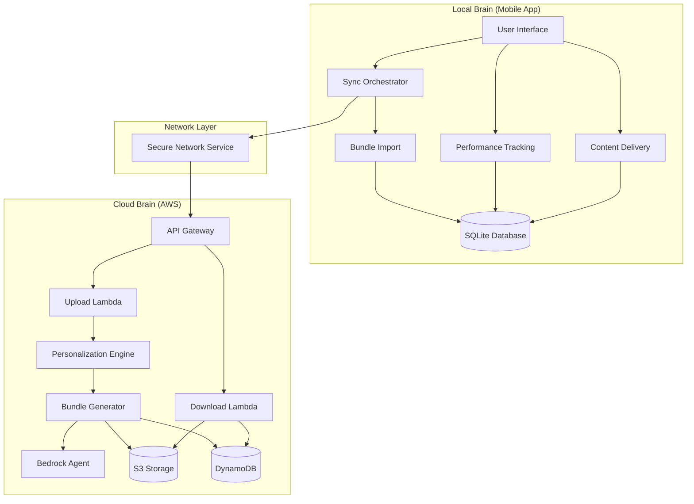
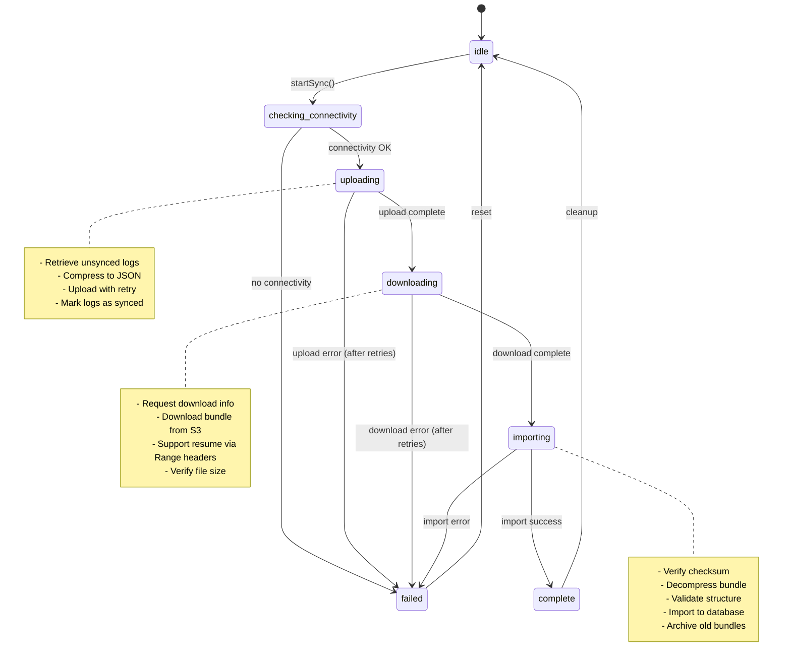

# Design Document: Sync With Cloud

## Overview

The Sync With Cloud feature implements a bidirectional synchronization system between Local Brain (React Native mobile app) and Cloud Brain (AWS Lambda backend) for the Sikshya Sathi educational platform. This design enables offline-first learning by allowing students to work without connectivity while ensuring their progress is synchronized and personalized content is delivered when connectivity becomes available.

### Key Design Goals

1. **Offline-First Architecture**: Students can learn without internet connectivity, with all content and functionality available locally
2. **Reliable Synchronization**: Performance data uploads and content downloads are resilient to network failures with automatic retry and resume capabilities
3. **Data Integrity**: All transferred data is verified using SHA-256 checksums to prevent corruption
4. **State Machine-Driven Workflow**: Sync operations follow a well-defined state machine that supports interruption and resumption
5. **Personalized Content Delivery**: AI-generated learning bundles are tailored to each student's performance and learning trajectory

### System Context

The sync system operates in two environments:

**Local Brain (React Native/TypeScript)**:
- Runs on student devices (Android/iOS)
- Stores data in SQLite with SQLCipher encryption
- Tracks student performance events offline
- Delivers lessons, quizzes, and hints from synchronized bundles
- Manages sync state machine and network operations

**Cloud Brain (AWS Lambda/Python)**:
- Processes uploaded performance logs
- Updates student knowledge models using AI
- Generates personalized learning bundles via Bedrock Agent
- Compresses and stores bundles in S3
- Provides presigned URLs for secure downloads

### Workflow Summary

1. **Connectivity Check**: Verify internet availability before starting sync
2. **Upload Phase**: Compress and upload performance logs to Cloud Brain
3. **Processing Phase**: Cloud Brain analyzes logs and generates personalized content
4. **Download Phase**: Retrieve compressed learning bundle from S3
5. **Verification Phase**: Validate bundle integrity using SHA-256 checksum
6. **Import Phase**: Decompress bundle and import content to local database
7. **Cleanup Phase**: Archive old bundles and delete synced logs

## Architecture

### High-Level Architecture



### Sync State Machine

The sync workflow is managed by a state machine with the following states:



### Component Architecture

The system is organized into service layers with clear separation of concerns:

**Sync Layer**:
- `SyncOrchestratorService`: Manages state machine and coordinates workflows
- `SyncErrorHandler`: Handles errors with retry logic and user feedback

**Network Layer**:
- `SecureNetworkService`: Provides TLS 1.3 encrypted HTTP client
- `AuthenticationService`: Manages JWT tokens with automatic refresh

**Storage Layer**:
- `BundleImportService`: Validates and imports learning bundles
- `DatabaseManager`: Provides transactional database access
- Repository pattern for each entity type

**Content Layer**:
- `ContentDeliveryService`: Delivers lessons and quizzes offline
- `PerformanceTrackingService`: Logs student interactions

**Monitoring Layer**:
- `MonitoringService`: Tracks metrics and errors

## Components and Interfaces

### SyncOrchestratorService

**Responsibilities**:
- Detect network connectivity
- Manage sync session lifecycle
- Coordinate upload, download, and import workflows
- Handle errors with exponential backoff retry
- Support sync resumption after interruption

**Public Interface**:

```typescript
class SyncOrchestratorService {
  constructor(studentId: string, authToken: string, publicKey: string)
  
  // Start a new sync or resume interrupted sync
  async startSync(): Promise<SyncStatus>
  
  // Check if sync is needed (has unsynced logs)
  async isSyncNeeded(): Promise<boolean>
  
  // Get current sync status
  getSyncStatus(): SyncStatus
  
  // Check network connectivity
  async checkConnectivity(): Promise<boolean>
  
  // Clean up old sync sessions and logs
  async cleanup(): Promise<void>
}

interface SyncStatus {
  state: SyncState
  sessionId: string | null
  progress: number  // 0-100
  error: string | null
  logsUploaded: number
  bundleDownloaded: boolean
}

type SyncState = 
  | 'idle' 
  | 'checking_connectivity' 
  | 'uploading' 
  | 'downloading' 
  | 'importing' 
  | 'complete' 
  | 'failed'
```

**Key Methods**:

- `startSync()`: Entry point for sync workflow. Checks for in-progress sessions and resumes if found, otherwise starts new sync.
- `executeUploadWorkflow()`: Retrieves unsynced logs, converts to snake_case JSON, uploads with retry, marks logs as synced.
- `executeDownloadWorkflow()`: Requests download info, downloads bundle from S3 with resume support, verifies checksum, imports bundle.
- `resumeSync()`: Resumes interrupted sync by determining last completed phase and continuing from there.

**Error Handling**:
- Network errors: Retry up to 3 times with exponential backoff (1s, 2s, 4s) plus random jitter (0-1000ms)
- Authentication errors (401): Attempt token refresh once, then fail with non-retryable error
- Server errors (500): Retry with backoff
- Checksum errors: Retry download up to 3 times

### BundleImportService

**Responsibilities**:
- Verify bundle checksum (SHA-256)
- Decompress gzip-compressed bundles
- Validate bundle structure against schema
- Import content to database in atomic transaction
- Archive old bundles and clean up expired content

**Public Interface**:

```typescript
class BundleImportService {
  constructor(publicKey: string)
  
  // Import and validate a learning bundle
  async importBundle(bundlePath: string, expectedChecksum: string): Promise<void>
  
  // Validate bundle without importing
  async validateBundle(bundlePath: string, expectedChecksum: string): Promise<boolean>
  
  // Get bundle metadata without full import
  async getBundleMetadata(bundlePath: string): Promise<BundleMetadata | null>
}

interface BundleMetadata {
  bundleId: string
  studentId: string
  validFrom: Date
  validUntil: Date
  totalSize: number
  subjectCount: number
}
```

**Import Process**:

1. **Checksum Verification**: Calculate SHA-256 hash of compressed file and compare with expected value
2. **Decompression**: Read file as base64, decode to binary, decompress using pako.ungzip, decode as UTF-8
3. **Structure Validation**: Verify all required fields exist and have correct types
4. **Database Import**: Execute atomic transaction to insert bundle, lessons, quizzes, hints, and study tracks
5. **Archival**: Mark old bundles as archived and delete bundles older than 30 days

**Bundle Structure**:

```typescript
interface BundleData {
  bundle_id: string
  student_id: string
  valid_from: string  // ISO 8601 timestamp
  valid_until: string  // ISO 8601 timestamp
  total_size: number
  checksum: string  // Empty in compressed bundle, verified separately
  subjects: SubjectData[]
}

interface SubjectData {
  subject: string
  lessons: LessonData[]
  quizzes: QuizData[]
  hints: Record<string, HintData[]>  // Keyed by quiz_id
  study_track?: StudyTrackData
}
```

### ContentDeliveryService

**Responsibilities**:
- Deliver lessons and quizzes from active bundle
- Provide progressive hints (levels 1-3)
- Validate quiz answers with immediate feedback
- Cache content in memory for fast access
- Preload next 3 lessons in background

**Public Interface**:

```typescript
class ContentDeliveryService {
  constructor(dbManager: DatabaseManager)
  
  // Get next lesson for student in subject
  async getNextLesson(studentId: string, subject: string): Promise<Lesson | null>
  
  // Get next quiz for student in subject
  async getNextQuiz(studentId: string, subject: string): Promise<Quiz | null>
  
  // Get specific lesson by ID
  async getLessonById(lessonId: string): Promise<Lesson | null>
  
  // Get specific quiz by ID
  async getQuizById(quizId: string): Promise<Quiz | null>
  
  // Get hint for quiz question at specified level (1-3)
  async getHint(quizId: string, questionId: string, level: number): Promise<Hint | null>
  
  // Validate answer and provide feedback
  async validateAnswer(
    quizId: string, 
    questionId: string, 
    answer: string, 
    hintsUsed: number
  ): Promise<QuizFeedback>
  
  // Clear content cache
  clearCache(): void
  
  // Get cache statistics
  getCacheStats(): { lessons: number; quizzes: number; hints: number }
}

interface QuizFeedback {
  correct: boolean
  explanation: string
  nextHintLevel?: number  // Only if incorrect and hints available
  encouragement: string
}
```

**Caching Strategy**:
- Current lesson: Cached immediately on access
- Next 3 lessons: Preloaded in background queue
- Quizzes: Cached on first access
- Hints: All levels cached together on first retrieval

**Answer Validation**:
- Multiple choice / True-false: Case-insensitive exact match
- Short answer: Flexible matching with substring support

### PerformanceTrackingService

**Responsibilities**:
- Log student interaction events
- Write logs to SQLite immediately for crash recovery
- Mark logs as unsynced for upload
- Support querying unsynced logs

**Public Interface**:

```typescript
class PerformanceTrackingService {
  constructor(dbManager: DatabaseManager)
  
  // Log lesson start
  async logLessonStart(studentId: string, lessonId: string, subject: string, topic: string): Promise<void>
  
  // Log lesson completion
  async logLessonComplete(
    studentId: string, 
    lessonId: string, 
    subject: string, 
    topic: string, 
    timeSpent: number
  ): Promise<void>
  
  // Log quiz start
  async logQuizStart(studentId: string, quizId: string, subject: string, topic: string): Promise<void>
  
  // Log quiz answer
  async logQuizAnswer(
    studentId: string,
    quizId: string,
    questionId: string,
    subject: string,
    topic: string,
    answer: string,
    correct: boolean,
    hintsUsed: number
  ): Promise<void>
  
  // Log quiz completion
  async logQuizComplete(
    studentId: string,
    quizId: string,
    subject: string,
    topic: string,
    timeSpent: number,
    score: number
  ): Promise<void>
  
  // Log hint request
  async logHintRequested(
    studentId: string,
    quizId: string,
    questionId: string,
    subject: string,
    topic: string,
    hintLevel: number
  ): Promise<void>
}
```

**Event Types**:
- `lesson_start`: Student begins a lesson
- `lesson_complete`: Student finishes a lesson (includes timeSpent)
- `quiz_start`: Student begins a quiz
- `quiz_answer`: Student answers a question (includes answer, correct, hintsUsed)
- `quiz_complete`: Student finishes a quiz (includes timeSpent, score)
- `hint_requested`: Student requests a hint (includes hintLevel)

### SecureNetworkService

**Responsibilities**:
- Provide HTTP client with TLS 1.3 encryption
- Handle request/response serialization
- Support timeout configuration
- Provide typed response handling

**Public Interface**:

```typescript
class SecureNetworkService {
  static getInstance(): SecureNetworkService
  
  async get<T>(url: string, options?: RequestOptions): Promise<NetworkResponse<T>>
  async post<T>(url: string, body: any, options?: RequestOptions): Promise<NetworkResponse<T>>
  async put<T>(url: string, body: any, options?: RequestOptions): Promise<NetworkResponse<T>>
  async delete<T>(url: string, options?: RequestOptions): Promise<NetworkResponse<T>>
}

interface RequestOptions {
  headers?: Record<string, string>
  timeout?: number
  retries?: number
}

interface NetworkResponse<T> {
  ok: boolean
  status: number
  data?: T
  error?: string
}
```

### AuthenticationService

**Responsibilities**:
- Manage JWT access and refresh tokens
- Automatically refresh expired tokens
- Provide valid tokens for API requests
- Handle authentication failures

**Public Interface**:

```typescript
class AuthenticationService {
  static getInstance(): AuthenticationService
  
  async initialize(): Promise<void>
  async getAccessToken(): Promise<string>
  async refreshToken(): Promise<void>
  getAuthState(): AuthState
  setTemporaryToken(token: string, expiresInHours: number): void
}

interface AuthState {
  accessToken: string | null
  refreshToken: string | null
  expiresAt: number | null
  isAuthenticated: boolean
}
```

## Data Models

### SQLite Schema

The local database uses SQLite with SQLCipher encryption. All tables use snake_case naming to match backend conventions.

**learning_bundles**:
```sql
CREATE TABLE learning_bundles (
  bundle_id TEXT PRIMARY KEY,
  student_id TEXT NOT NULL,
  valid_from INTEGER NOT NULL,  -- Unix timestamp
  valid_until INTEGER NOT NULL,  -- Unix timestamp
  total_size INTEGER NOT NULL,
  checksum TEXT NOT NULL,
  status TEXT NOT NULL CHECK(status IN ('active', 'archived'))
);

CREATE INDEX idx_bundles_student ON learning_bundles(student_id, status);
```

**lessons**:
```sql
CREATE TABLE lessons (
  lesson_id TEXT PRIMARY KEY,
  bundle_id TEXT NOT NULL,
  subject TEXT NOT NULL,
  topic TEXT NOT NULL,
  title TEXT NOT NULL,
  difficulty TEXT NOT NULL CHECK(difficulty IN ('easy', 'medium', 'hard')),
  content_json TEXT NOT NULL,  -- JSON array of sections
  estimated_minutes INTEGER NOT NULL,
  curriculum_standards TEXT NOT NULL,  -- JSON array
  FOREIGN KEY (bundle_id) REFERENCES learning_bundles(bundle_id) ON DELETE CASCADE
);

CREATE INDEX idx_lessons_bundle ON lessons(bundle_id);
CREATE INDEX idx_lessons_subject ON lessons(subject, topic);
```

**quizzes**:
```sql
CREATE TABLE quizzes (
  quiz_id TEXT PRIMARY KEY,
  bundle_id TEXT NOT NULL,
  subject TEXT NOT NULL,
  topic TEXT NOT NULL,
  title TEXT NOT NULL,
  difficulty TEXT NOT NULL CHECK(difficulty IN ('easy', 'medium', 'hard')),
  time_limit INTEGER,  -- Minutes, nullable
  questions_json TEXT NOT NULL,  -- JSON array of questions
  FOREIGN KEY (bundle_id) REFERENCES learning_bundles(bundle_id) ON DELETE CASCADE
);

CREATE INDEX idx_quizzes_bundle ON quizzes(bundle_id);
CREATE INDEX idx_quizzes_subject ON quizzes(subject, topic);
```

**hints**:
```sql
CREATE TABLE hints (
  hint_id TEXT PRIMARY KEY,
  quiz_id TEXT NOT NULL,
  question_id TEXT NOT NULL,
  level INTEGER NOT NULL CHECK(level >= 1 AND level <= 3),
  hint_text TEXT NOT NULL,
  FOREIGN KEY (quiz_id) REFERENCES quizzes(quiz_id) ON DELETE CASCADE
);

CREATE INDEX idx_hints_quiz ON hints(quiz_id, question_id);
```

**performance_logs**:
```sql
CREATE TABLE performance_logs (
  log_id INTEGER PRIMARY KEY AUTOINCREMENT,
  student_id TEXT NOT NULL,
  timestamp INTEGER NOT NULL,  -- Unix timestamp
  event_type TEXT NOT NULL CHECK(event_type IN (
    'lesson_start', 'lesson_complete', 'quiz_start', 
    'quiz_answer', 'quiz_complete', 'hint_requested'
  )),
  content_id TEXT NOT NULL,
  subject TEXT NOT NULL,
  topic TEXT NOT NULL,
  data_json TEXT NOT NULL,  -- JSON object with event-specific data
  synced INTEGER DEFAULT 0 CHECK(synced IN (0, 1))
);

CREATE INDEX idx_logs_sync ON performance_logs(synced, timestamp);
CREATE INDEX idx_logs_student ON performance_logs(student_id, subject);
```

**sync_sessions**:
```sql
CREATE TABLE sync_sessions (
  session_id TEXT PRIMARY KEY,
  start_time INTEGER NOT NULL,  -- Unix timestamp
  end_time INTEGER,  -- Unix timestamp, nullable
  status TEXT NOT NULL CHECK(status IN (
    'pending', 'uploading', 'downloading', 'complete', 'failed'
  )),
  logs_uploaded INTEGER DEFAULT 0,
  bundle_downloaded INTEGER DEFAULT 0,
  error_message TEXT
);

CREATE INDEX idx_sync_status ON sync_sessions(status, start_time DESC);
```

**study_tracks**:
```sql
CREATE TABLE study_tracks (
  track_id TEXT PRIMARY KEY,
  bundle_id TEXT NOT NULL,
  subject TEXT NOT NULL,
  weeks_json TEXT NOT NULL,  -- JSON array of weeks
  FOREIGN KEY (bundle_id) REFERENCES learning_bundles(bundle_id) ON DELETE CASCADE
);

CREATE INDEX idx_tracks_bundle ON study_tracks(bundle_id, subject);
```

### DynamoDB Schema (Cloud Brain)

**bundles_metadata** table:
```
Partition Key: student_id (String)
Sort Key: bundle_id (String)

Attributes:
- s3_key (String): S3 object key
- total_size (Number): Bundle size in bytes
- checksum (String): SHA-256 hash
- valid_from (String): ISO 8601 timestamp
- valid_until (String): ISO 8601 timestamp
- subjects (List): Array of subject names
- content_count (Map): { lessons: Number, quizzes: Number }
- generation_timestamp (String): ISO 8601 timestamp
- presigned_url (String): S3 presigned URL
- presigned_url_expires (String): ISO 8601 timestamp
```

### API Contracts

**Upload Endpoint**: `POST /sync/upload`

Request:
```json
{
  "student_id": "string",
  "logs": [
    {
      "student_id": "string",
      "timestamp": "2024-01-15T10:30:00Z",
      "event_type": "quiz_answer",
      "content_id": "quiz_123",
      "subject": "Mathematics",
      "topic": "Algebra",
      "data": {
        "answer": "10",
        "correct": true,
        "hintsUsed": 1
      }
    }
  ],
  "last_sync_time": "2024-01-14T08:00:00Z"
}
```

Response:
```json
{
  "sessionId": "backend_session_abc123",
  "logsReceived": 15,
  "bundleReady": true
}
```

**Download Endpoint**: `GET /sync/download/{sessionId}`

Response:
```json
{
  "bundleUrl": "https://s3.amazonaws.com/...",
  "bundleSize": 5242880,
  "checksum": "a1b2c3d4e5f6...",
  "validUntil": "2024-01-29T10:30:00Z"
}
```


## Correctness Properties

*A property is a characteristic or behavior that should hold true across all valid executions of a system—essentially, a formal statement about what the system should do. Properties serve as the bridge between human-readable specifications and machine-verifiable correctness guarantees.*

### Property Reflection

After analyzing all acceptance criteria, I identified several areas where properties can be consolidated to eliminate redundancy:

**Consolidated Areas**:
1. **State Machine Transitions**: Multiple criteria about state transitions (1.3, 1.6, 4.5, 20.7) can be combined into comprehensive state machine properties
2. **Retry Logic**: Criteria 4.1-4.7 about retry behavior can be consolidated into fewer, more comprehensive properties
3. **Data Structure Validation**: Criteria 9.1-9.7 about bundle validation can be combined into a single comprehensive validation property
4. **Progress Tracking**: Criteria 27.3-27.7 about progress percentages can be combined into one property mapping states to progress
5. **Event Logging**: Criteria 16.1-16.8 about performance tracking can be consolidated into properties about log structure and persistence
6. **Transaction Operations**: Criteria 10.1-10.8 about database transactions can be combined into atomicity and ordering properties

This reflection ensures each property provides unique validation value without logical redundancy.

### Property 1: Connectivity Check Timeout Bounds

*For any* connectivity check operation, the timeout duration shall not exceed 5 seconds.

**Validates: Requirements 1.2**

### Property 2: Sync Abort on Connectivity Failure

*For any* sync attempt where connectivity check fails, the Sync_Orchestrator shall transition to 'idle' state without proceeding to upload.

**Validates: Requirements 1.3**

### Property 3: Session Creation on Successful Connectivity

*For any* successful connectivity check, a Sync_Session record shall be created with a unique session_id, start_time, and status 'pending'.

**Validates: Requirements 1.4, 1.5**

### Property 4: State Machine Transition Ordering

*For any* sync workflow, state transitions shall follow the valid sequence: idle → checking_connectivity → uploading → downloading → importing → complete, with transitions to 'failed' allowed from any non-terminal state.

**Validates: Requirements 1.6, 4.5, 20.7**

### Property 5: Unsynced Log Retrieval Completeness

*For any* upload workflow, all performance logs with synced=0 for the student shall be retrieved from the database.

**Validates: Requirements 2.1**

### Property 6: Log Serialization Format

*For any* performance log, conversion to upload format shall produce a JSON object with snake_case field names (student_id, timestamp, event_type, content_id, subject, topic, data).

**Validates: Requirements 2.2**

### Property 7: Upload Request Structure

*For any* upload request, the payload shall contain student_id, logs array, and last_sync_time fields.

**Validates: Requirements 2.3**

### Property 8: Authorization Header Presence

*For any* upload or download request, an Authorization header with format "Bearer {token}" shall be included.

**Validates: Requirements 2.4**

### Property 9: Log Sync Status Update

*For any* successful upload, all uploaded logs shall be marked with synced=1 in the local database.

**Validates: Requirements 2.6**

### Property 10: Session Upload Count Update

*For any* successful upload, the Sync_Session record shall be updated with logs_uploaded equal to the number of logs sent.

**Validates: Requirements 2.7**

### Property 11: First-Time User Identification

*For any* student without an active Learning_Bundle record, the Sync_Orchestrator shall identify them as a first-time user.

**Validates: Requirements 3.1**

### Property 12: First-Time User Empty Upload

*For any* first-time user, the upload request shall contain an empty logs array.

**Validates: Requirements 3.2**

### Property 13: First-Time User Download Workflow

*For any* first-time user after upload completion, the download workflow shall proceed regardless of logs uploaded.

**Validates: Requirements 3.7**

### Property 14: Retry Attempt Limit

*For any* network request failure, the number of retry attempts shall not exceed 3.

**Validates: Requirements 4.1**

### Property 15: Exponential Backoff Timing

*For any* retry sequence, the base delays shall follow the pattern [1s, 2s, 4s] before jitter is applied.

**Validates: Requirements 4.2**

### Property 16: Jitter Bounds

*For any* backoff delay, the added jitter shall be between 0 and 1000 milliseconds inclusive.

**Validates: Requirements 4.3**

### Property 17: Maximum Backoff Cap

*For any* calculated backoff delay, the final value shall not exceed 30 seconds.

**Validates: Requirements 4.4**

### Property 18: Non-Retryable Authentication Errors

*For any* request that fails with 401 status, no retry attempts shall occur (non-retryable error).

**Validates: Requirements 4.7**

### Property 19: Download Info Request After Upload

*For any* successful upload workflow completion, a download info request shall be sent to Cloud_Brain.

**Validates: Requirements 5.1**

### Property 20: Download Request Session ID

*For any* download info request, the backend session_id from the upload response shall be included in the request.

**Validates: Requirements 5.2**

### Property 21: Download File Size Verification

*For any* completed download, the downloaded file size shall match the bundleSize value from download info.

**Validates: Requirements 5.7**

### Property 22: Session Bundle Downloaded Flag

*For any* successful download, the Sync_Session record shall be updated with bundle_downloaded=1.

**Validates: Requirements 5.8**

### Property 23: Download Progress Persistence

*For any* interrupted download, a progress record containing sessionId, bundleUrl, totalBytes, downloadedBytes, checksum, and filePath shall be stored.

**Validates: Requirements 6.1, 6.2**

### Property 24: Resume Range Header Format

*For any* resumed download, the HTTP Range header shall be formatted as "bytes={downloadedBytes}-".

**Validates: Requirements 6.3**

### Property 25: Resume Precondition Check

*For any* download resume attempt, the partial file existence shall be verified before sending the Range request.

**Validates: Requirements 6.5**

### Property 26: Cross-Restart Resume Support

*For any* app restart with an incomplete download, the download shall be resumable using stored progress data.

**Validates: Requirements 6.7**

### Property 27: Checksum Calculation on Download

*For any* completed download, a SHA-256 checksum shall be calculated on the downloaded file.

**Validates: Requirements 7.1**

### Property 28: Checksum Comparison

*For any* downloaded file, the calculated checksum shall be compared against the expected checksum from download info.

**Validates: Requirements 7.3**

### Property 29: Checksum Mismatch File Deletion

*For any* checksum mismatch, the downloaded file shall be deleted from local storage.

**Validates: Requirements 7.4**

### Property 30: Checksum Mismatch Logging

*For any* checksum mismatch, an error log entry shall be created containing both expected and actual checksum values.

**Validates: Requirements 7.5**

### Property 31: Checksum Failure Retry

*For any* checksum verification failure, the download shall be retried up to 3 times.

**Validates: Requirements 7.6**

### Property 32: Import After Successful Verification

*For any* successful checksum verification, the bundle import workflow shall proceed.

**Validates: Requirements 7.7**

### Property 33: Bundle Decompression Round-Trip

*For any* valid compressed bundle, the sequence of operations (read as base64 → decode to binary → decompress with pako.ungzip → decode as UTF-8 → parse as JSON) shall produce a valid BundleData object.

**Validates: Requirements 8.1, 8.2, 8.4, 8.5, 25.3, 25.4**

### Property 34: Bundle Structure Validation Completeness

*For any* parsed bundle, validation shall verify the presence and correct types of: bundle_id (non-empty string), student_id (non-empty string), valid_from (string), valid_until (string), checksum (string), subjects (array), and for each subject: subject name (string), lessons (array), quizzes (array).

**Validates: Requirements 9.1, 9.2, 9.3, 9.4, 9.5, 9.6, 9.7**

### Property 35: Parser Field Type Support

*For any* bundle field type (string, integer, date, array, nested object), the parser shall correctly deserialize the value.

**Validates: Requirements 25.6**

### Property 36: Missing Field Rejection

*For any* bundle with missing required fields, the parser shall reject the bundle with a descriptive error.

**Validates: Requirements 25.7**

### Property 37: Transaction Atomicity

*For any* bundle import, all database operations (bundle insert, lesson inserts, quiz inserts, hint inserts, study track insert) shall execute within a single transaction that either commits all changes or rolls back all changes.

**Validates: Requirements 10.1, 10.7, 10.8**

### Property 38: Import Operation Ordering

*For any* bundle import transaction, operations shall execute in order: (1) insert Learning_Bundle, (2) insert all lessons, (3) insert all quizzes, (4) insert all hints, (5) insert study_track if present.

**Validates: Requirements 10.2, 10.3, 10.4, 10.5, 10.6**

### Property 39: Old Bundle Archival

*For any* successful bundle import, all previous bundles for the student shall be updated to status='archived'.

**Validates: Requirements 11.1, 11.2**

### Property 40: Archived Bundle Retention

*For any* cleanup operation, archived bundles with valid_until older than 30 days shall be deleted.

**Validates: Requirements 11.3**

### Property 41: Cascade Deletion

*For any* deleted Learning_Bundle, all associated lessons, quizzes, and hints shall be deleted via foreign key cascade.

**Validates: Requirements 11.4**

### Property 42: Single Active Bundle Invariant

*For any* student at any time, at most one Learning_Bundle with status='active' shall exist.

**Validates: Requirements 11.5**

### Property 43: Performance Event Log Structure

*For any* performance tracking event (lesson_start, lesson_complete, quiz_start, quiz_answer, quiz_complete, hint_requested), a log record shall be created with student_id, timestamp, event_type, content_id, subject, topic, data_json, and synced=0.

**Validates: Requirements 16.1, 16.2, 16.3, 16.4, 16.5, 16.6, 16.8**

### Property 44: Immediate Log Persistence

*For any* performance event, the log shall be written to SQLite immediately (not buffered).

**Validates: Requirements 16.7**

### Property 45: Active Bundle Query

*For any* content request (lesson or quiz), the Content_Delivery_Service shall query the Learning_Bundle with status='active' for the student.

**Validates: Requirements 17.1, 17.5**

### Property 46: Study Track Ordering

*For any* lesson sequence, the order shall match the Study_Track weeks and days structure.

**Validates: Requirements 17.2**

### Property 47: Content Caching

*For any* accessed lesson or quiz, the content shall be stored in the in-memory cache.

**Validates: Requirements 17.3, 17.6**

### Property 48: Lesson Preloading

*For any* lesson access, the next 3 lessons in the study track shall be added to the preload queue.

**Validates: Requirements 17.4**

### Property 49: No Bundle Returns Null

*For any* content request when no active bundle exists, the service shall return null.

**Validates: Requirements 17.7**

### Property 50: Hint Level Validation

*For any* hint request, the level parameter shall be validated to be between 1 and 3 inclusive.

**Validates: Requirements 18.2**

### Property 51: Hint Retrieval by Level

*For any* hint request, the service shall return the hint matching the requested level for the specified quiz and question.

**Validates: Requirements 18.5**

### Property 52: Non-Existent Hint Returns Null

*For any* hint request where the requested level does not exist, the service shall return null.

**Validates: Requirements 18.6**

### Property 53: Hint Offline Availability

*For any* hint in the active bundle, the hint shall be retrievable without network connectivity.

**Validates: Requirements 18.7**

### Property 54: Answer Comparison Logic

*For any* multiple_choice or true_false question, answer validation shall use case-insensitive exact matching; for short_answer questions, validation shall allow partial and substring matching.

**Validates: Requirements 19.2, 19.3**

### Property 55: Feedback Structure

*For any* answer validation, the returned QuizFeedback shall contain correct (boolean), explanation (string), and encouragement (string) fields.

**Validates: Requirements 19.4**

### Property 56: Next Hint Level Inclusion

*For any* incorrect answer where hintsUsed < 3, the feedback shall include nextHintLevel = hintsUsed + 1.

**Validates: Requirements 19.5**

### Property 57: Contextual Encouragement

*For any* feedback, the encouragement message shall vary based on correctness and hintsUsed count.

**Validates: Requirements 19.6**

### Property 58: In-Progress Session Detection

*For any* sync start, the Sync_Orchestrator shall query for Sync_Session records with status in ('pending', 'uploading', 'downloading').

**Validates: Requirements 20.1**

### Property 59: Resume Over New Session

*For any* sync start where an in-progress session exists, the Sync_Orchestrator shall resume that session instead of creating a new one.

**Validates: Requirements 20.2**

### Property 60: Phase Detection from Status

*For any* resume operation, the last completed phase shall be determined from the session status and flags (logs_uploaded, bundle_downloaded).

**Validates: Requirements 20.3, 20.4, 20.5**

### Property 61: Session ID Continuity

*For any* resumed sync, the original session_id shall be used for all subsequent operations.

**Validates: Requirements 20.6**

### Property 62: Sync Status Progress Mapping

*For any* sync state, the progress percentage shall be: idle=0%, checking_connectivity=10%, uploading=30%, downloading=60%, importing=90%, complete=100%, failed=0%.

**Validates: Requirements 27.2, 27.3, 27.4, 27.5, 27.6, 27.7**

### Property 63: Progress Bounds

*For any* sync status, the progress value shall be between 0 and 100 inclusive.

**Validates: Requirements 27.2**


## Error Handling

### Error Classification

Errors are classified into two categories for retry logic:

**Retryable Errors**:
- Network timeouts
- Server errors (500, 502, 503)
- Checksum mismatches
- Temporary file system errors
- Database lock errors

**Non-Retryable Errors**:
- Authentication failures (401)
- Authorization failures (403)
- Client errors (400, 404)
- Invalid bundle structure
- Disk space exhausted

### Retry Strategy

**Exponential Backoff with Jitter**:
```
Attempt 1: 1000ms + random(0-1000ms)
Attempt 2: 2000ms + random(0-1000ms)
Attempt 3: 4000ms + random(0-1000ms)
Maximum: 30000ms
```

**Retry Limits**:
- Network requests: 3 attempts
- Checksum verification: 3 attempts
- Database operations: 3 attempts

### Error Recovery

**Upload Failures**:
- Logs remain marked as unsynced (synced=0)
- Will be included in next sync attempt
- No data loss occurs

**Download Failures**:
- Partial downloads are preserved for resume
- Corrupted files are deleted and restarted
- Session state allows resume after app restart

**Import Failures**:
- Transaction rollback ensures database consistency
- Downloaded bundle file is preserved for retry
- Session remains in 'downloading' state for resume

### User-Facing Error Messages

Error messages are designed to be clear and actionable:

| Error Condition | User Message |
|----------------|--------------|
| No connectivity | "No internet connection. Sync will retry when online." |
| Upload failed | "Upload failed. Your progress is saved and will sync later." |
| Download failed | "Download failed. Please try again when you have a stable connection." |
| Checksum failed | "Content verification failed. Retrying download." |
| Auth expired | "Session expired. Please log in again." |
| Import failed | "Content import failed. Please contact support." |

### Error Logging

All errors are logged with structured data for debugging:

```typescript
interface ErrorLog {
  category: 'network' | 'storage' | 'database' | 'validation'
  severity: 'low' | 'medium' | 'high'
  message: string
  details: Record<string, any>
  timestamp: number
  studentId: string
  sessionId?: string
}
```

**Severity Levels**:
- **Low**: Transient errors that will retry (network timeout)
- **Medium**: Errors requiring user action (disk space low)
- **High**: Critical errors requiring support (database corruption)

### Monitoring and Alerting

**Metrics Tracked**:
- Sync success rate
- Sync duration (p50, p95, p99)
- Upload failure rate by error type
- Download failure rate by error type
- Checksum mismatch rate
- Bundle generation latency
- Token refresh success rate

**Alert Conditions**:
- Sync success rate < 90% over 1 hour
- Checksum mismatch rate > 1% over 1 hour
- Average sync duration > 5 minutes
- Token refresh failure rate > 5%

## Testing Strategy

### Dual Testing Approach

The testing strategy employs both unit tests and property-based tests to ensure comprehensive coverage:

**Unit Tests**:
- Verify specific examples and edge cases
- Test integration points between components
- Validate error conditions and error messages
- Test UI interactions and user feedback
- Mock external dependencies (network, file system)

**Property-Based Tests**:
- Verify universal properties across all inputs
- Generate random test data for comprehensive coverage
- Test invariants and round-trip properties
- Validate state machine transitions
- Run minimum 100 iterations per property

Both approaches are complementary: unit tests catch concrete bugs in specific scenarios, while property tests verify general correctness across the input space.

### Property-Based Testing Configuration

**Framework**: Use `fast-check` for TypeScript/JavaScript property-based testing

**Test Configuration**:
```typescript
import fc from 'fast-check';

// Minimum 100 iterations per property test
const propertyConfig = {
  numRuns: 100,
  verbose: true,
  seed: Date.now(),
};

// Example property test structure
describe('Feature: sync-with-cloud, Property 6: Log Serialization Format', () => {
  it('should convert all performance logs to snake_case JSON format', () => {
    fc.assert(
      fc.property(
        performanceLogArbitrary(),
        (log) => {
          const serialized = convertLogToUploadFormat(log);
          
          // Verify snake_case field names
          expect(serialized).toHaveProperty('student_id');
          expect(serialized).toHaveProperty('event_type');
          expect(serialized).toHaveProperty('content_id');
          expect(serialized).not.toHaveProperty('studentId');
          expect(serialized).not.toHaveProperty('eventType');
        }
      ),
      propertyConfig
    );
  });
});
```

**Arbitrary Generators**:

Custom generators for domain objects:

```typescript
// Generate random performance logs
const performanceLogArbitrary = () => fc.record({
  studentId: fc.uuid(),
  timestamp: fc.date(),
  eventType: fc.constantFrom('lesson_start', 'lesson_complete', 'quiz_answer'),
  contentId: fc.uuid(),
  subject: fc.constantFrom('Mathematics', 'Science', 'English'),
  topic: fc.string({ minLength: 3, maxLength: 50 }),
  data: fc.record({
    timeSpent: fc.option(fc.nat({ max: 3600 })),
    answer: fc.option(fc.string()),
    correct: fc.option(fc.boolean()),
    hintsUsed: fc.option(fc.nat({ max: 3 })),
  }),
});

// Generate random bundle data
const bundleDataArbitrary = () => fc.record({
  bundle_id: fc.uuid(),
  student_id: fc.uuid(),
  valid_from: fc.date().map(d => d.toISOString()),
  valid_until: fc.date().map(d => d.toISOString()),
  total_size: fc.nat({ max: 10_000_000 }),
  checksum: fc.hexaString({ minLength: 64, maxLength: 64 }),
  subjects: fc.array(subjectDataArbitrary(), { minLength: 1, maxLength: 5 }),
});

// Generate random sync states
const syncStateArbitrary = () => fc.constantFrom(
  'idle', 'checking_connectivity', 'uploading', 
  'downloading', 'importing', 'complete', 'failed'
);
```

### Property Test Coverage

Each correctness property from the design document must be implemented as a property-based test:

**State Machine Properties** (Properties 2, 4, 13, 19, 32, 58, 59):
- Test all valid state transitions
- Verify invalid transitions are rejected
- Test resume behavior from each state

**Data Transformation Properties** (Properties 6, 33, 34, 36):
- Round-trip serialization/deserialization
- Format conversion (camelCase ↔ snake_case)
- Bundle compression/decompression

**Retry Logic Properties** (Properties 14, 15, 16, 17, 18, 31):
- Backoff timing calculations
- Jitter bounds
- Retry attempt limits
- Non-retryable error handling

**Data Integrity Properties** (Properties 27, 28, 29, 37, 41, 42):
- Checksum verification
- Transaction atomicity
- Cascade deletion
- Single active bundle invariant

**Content Delivery Properties** (Properties 45, 46, 47, 48, 54, 55):
- Lesson ordering
- Caching behavior
- Answer validation logic
- Feedback structure

### Unit Test Coverage

**Component Tests**:

1. **SyncOrchestratorService**:
   - Test connectivity check with mocked network
   - Test upload workflow with various log counts (0, 1, 100)
   - Test download workflow with resume scenarios
   - Test error handling for each error type
   - Test state transitions for all paths

2. **BundleImportService**:
   - Test checksum verification with valid/invalid checksums
   - Test decompression with valid/corrupted data
   - Test structure validation with missing fields
   - Test transaction rollback on error
   - Test archival of old bundles

3. **ContentDeliveryService**:
   - Test lesson retrieval with/without active bundle
   - Test caching behavior
   - Test preloading queue
   - Test answer validation for each question type
   - Test hint retrieval for all levels

4. **PerformanceTrackingService**:
   - Test log creation for each event type
   - Test immediate persistence
   - Test synced flag initialization

**Integration Tests**:

1. **End-to-End Sync Flow**:
   - Test complete sync from start to finish
   - Test first-time user flow
   - Test resume after interruption
   - Test sync with no new logs

2. **Database Integration**:
   - Test transaction commit/rollback
   - Test cascade deletion
   - Test foreign key constraints
   - Test index usage for queries

3. **Network Integration**:
   - Test with mock API responses
   - Test timeout handling
   - Test retry behavior
   - Test token refresh

### Edge Cases and Error Conditions

**Edge Cases to Test**:

1. **Empty Data**:
   - Empty logs array for first-time users
   - Empty bundle (no lessons or quizzes)
   - Empty hint text

2. **Boundary Values**:
   - Maximum bundle size (10MB)
   - Maximum retry attempts (3)
   - Maximum hint level (3)
   - Minimum hint level (1)
   - Progress bounds (0-100)

3. **Concurrent Operations**:
   - Multiple sync attempts simultaneously
   - Sync during content access
   - Database writes during sync

4. **Resource Constraints**:
   - Low disk space during download
   - Low memory during import
   - Database locked during write

5. **Data Corruption**:
   - Corrupted compressed bundle
   - Invalid JSON in bundle
   - Checksum mismatch
   - Partial file corruption

**Error Conditions to Test**:

1. **Network Errors**:
   - Connection timeout
   - DNS resolution failure
   - SSL/TLS handshake failure
   - Server unavailable (503)

2. **Authentication Errors**:
   - Expired token
   - Invalid token
   - Token refresh failure

3. **Validation Errors**:
   - Missing required fields
   - Invalid field types
   - Invalid enum values
   - Malformed JSON

4. **File System Errors**:
   - File not found
   - Permission denied
   - Disk full
   - Path too long

### Test Data Management

**Mock Data**:
- Use realistic student IDs, lesson IDs, quiz IDs
- Generate valid curriculum standards
- Create diverse question types and difficulties
- Include various subjects and topics

**Test Fixtures**:
- Sample compressed bundles (valid and invalid)
- Sample performance logs for each event type
- Sample API responses (success and error)
- Sample database states (empty, populated, corrupted)

### Performance Testing

**Benchmarks**:
- Sync duration for various log counts (10, 100, 1000)
- Bundle import time for various sizes (1MB, 5MB, 10MB)
- Content delivery latency (cache hit vs miss)
- Database query performance

**Performance Targets**:
- Sync completion: < 2 minutes for 100 logs
- Bundle import: < 10 seconds for 5MB bundle
- Lesson retrieval: < 100ms (cache hit), < 500ms (cache miss)
- Quiz validation: < 50ms

### Continuous Integration

**CI Pipeline**:
1. Run unit tests on every commit
2. Run property tests on every PR
3. Run integration tests on merge to main
4. Run performance tests nightly
5. Generate coverage reports (target: 80% line coverage)

**Test Environments**:
- Local development: SQLite in-memory, mocked network
- CI environment: SQLite file-based, mocked network
- Staging: Real SQLite, real API (test environment)
- Production: Real SQLite, real API (production environment)

